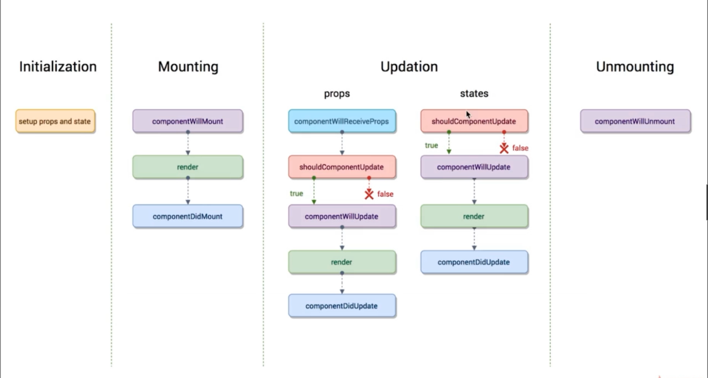
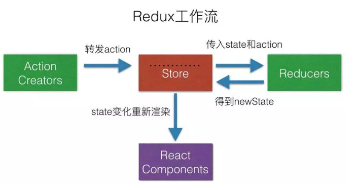

## [React](https://www.reactjscn.com/)

- React 的简介
  - React 是 Facebook 推出的
  - 2013 年开源
  - 函数式编程
  - 声名式开发
  - 可以与其他框架并存
  - 组件化
  - 单向数据流
  - 视图层框架
  - 使用人数最多的前端框架
  - 健全的文档与完善的社区
  - react16 版本即之后被称为"React Fiber"
- React 的开发环境准备
  - 引入 js 文件使用 React
  - 通过脚手架工具来编码
  - create-react-app
- React 的语法与注意点
  - React 中有一个 immutable 的概念: state 不允许做任何的改变
  - 在函数中,如果想改变 state 中的数据内容,需要使用 this.setState({key: value})
  - 调用函数的时候要使用 bind(this) 绑定 this 指向,如果没有绑定 this 指向的话, this 的指向为 undefined
  - React 的数据循环要给每一项唯一一个 key 标识符
  - React 中数据渲染,使用 map()
  
    ```

      dangerouslySetInnerHTMl 是React标签的一个属性,相当于 v-html
      {{}}，第一{}代表jsx语法开始，第二个是代表dangerouslySetInnerHTML接收的是一个对象值对
      既可以插入DOM，又可以插入字符串
      写法: dangerouslySetInnerHTML={{__html: 需要解析的数据}}

    ```
  - label 标签的 for 标签需要替换成 htmlFor 
- React 中的虚拟 DOM 
  - 先定义 state 数据
  - 再定义 JSX 模板
  - state 数据 + JSX 模板结合,生成虚拟 DOM (虚拟 DOM 就是一个 JS 对象,用它来描述真实的 DOM)
  - 用虚拟 DOM 的结构生成真实的 DOM,来显示
  - state 发生变化
  - 数据 + 模板生成新的虚拟 DOM 
  - 比较原始虚拟 DOM 和新的虚拟 DOM 的区别,找到区别
  - 直接操作 DOM,改变变更的内容

### React 的生命周期

> 生命周期函数指在某一个时刻组件会自动调用执行的函数

- Initialization(初始化过程)
  - 初始化数据和组件(相当于 React 中的 constructor,虽说 constructor 虽然属于 ES6 的语法,但是也相当于 React 的声明周期)
- Mounting(挂载过程)
  - componentWillMount:在组件即将被挂载到页面的时刻自动执行
  - render:页面挂载
  - componentDidMount:在组件被挂载到页面之后自动执行
- Updation(更新时刻)
  - props(组件)
    - componentWillReceiveProps:当一个组件从父组件接受参数,只要父组件的 render 函数被执行,子组件的这个生命周期函数就会被自动执行
      - 如果这个组件第一次存在于父组件中,不会执行
      - 如果这个组件之前已经存在于父组件中,才会执行
    - shouldComponentUpdate:组件被更新之前,它会自动被执行
    - componentWillUpdate:组件被更新之前,它会自动执行,但是在 shouldComponentUpdate 之后被执行
      - 如果 shouldComponentUpdate 返回 true,它才执行,否则反之 
    - render:页面挂载
    - componentDidUpdate:组件更新完成之后自动执行
  - states(数据)
    - shouldComponentUpdate:组件被更新之前,它会自动被执行
    - componentWillUpdate:组件被更新之前,它会自动执行,但是在 shouldComponentUpdate 之后被执行
      - 如果 shouldComponentUpdate 返回 true,它才执行,否则反之 
    - render:页面挂载
    - componentDidUpdate:组件更新完成之后自动执行
- Unmounting(解除挂载)
  - componentWillUnmount:当组件即将被从页面中剔除的时候自动执行
  


### Redux 工作流

#### 使用 Redux 的原因

- 在 React 中,数据在组件中是单向流动的,数据从一个方向父组件流向子组件(通过 props),所以,两个非父子组件之间通信就相对麻烦, Redux 的出现就是为了解决 state 里面的数据问题

#### Redux 的设计理念

- Redux 是将整个应用状态存储到一个地方上称为 store,里面保存着一个状态树 store tree,组件可以派发(dispatch)行为(action)给 store,而不是直接通知其他组件,组件内部通过订阅 store 中的状态 state 来刷新自己的视图



#### Redux 的三大原则

- 唯一数据源
  - 整个应用的 state 都被存储到一个状态树里面,并且这个状态树,只存在于唯一的 store 中
- 保持只读状态
  - state 是只读的,唯一改变 state 的方法就是触发 action, action 是一个用于描述以发生时间的普通对象
- 数据改变只能通过纯函数来执行
  - 使用纯函数来执行修改,为了描述 action 如何改变 state 的,需要编写 reducers

#### Redux 概念解析

- store
  - store 就是保存数据的地方,可以把它看成一个数据,整个应用只能有一个 store
  - Redux 提供 createStore 这个函数,用来生成 store

  ```

    import { createStore } from "redux"
    const store = createStore(fn)

  ```

- state
  - state 就是 store 里面存储的数据, store 里面可以拥有多个 state, Redux 规定一个 state 对应一个 view,只要 state 相同, view 就是一样的,反过来也是一样的,可以通过 store.getState() 获取

  ```

    import {createStore} from 'redux'
    const store=createStore(fn);
    const state=store.getState()

  ```

- action 
  - state 的改变会导致 view 的变化,但是在 Redux 中不能直接操作 state 也就是说不能使用 this.setState 来操作,用户只能接触到 view;在 Redux 中提供了一个对象来告诉 store 需要改变 state; action 是一个对象,其中 type 属性是必须的,表示 action 的名称,其他的可以根据需求自由设置

  ```

    const action={
      type: ADD_TODO,
      payload:'redux原理'
    }
    // 在上面代码中, action 的名称是 ADD_TODO,携带的数据是字符串'redux 原理', action 描述当前发生的事情,这是改变 state 的唯一的方式

  ```

- store.dispatch()
  - store.dispatch() 是 view 发出 action 的唯一办法

  ```

    store.dispatch({
      type: ADD_TODO,
      payload:'redux原理'
    })
    // store.dispatch 接收一个 action 作为参数,将它发送给 store 通知 store 来改变 state

  ```

- reducer
  - store 收到 action 以后,必须给出一个新的 state,这样 view 才会发生变化,这种 state 的计算过程就叫做 reducer
  - reducer 是一个纯函数,它接收 action 和当前 state 作为参数,返回一个新的 state
  - 注意: reducer 必须是一个纯函数,也就是说函数返回的结果必须由参数 state 和 action 决定,而且不产生任何副作用也不能修改 state 和 action 对象

  ```

    const reducer =(state,action)=>{
      switch(action.type){
        case ADD_TODO:
            return newstate;
        default return state
      }
    }

  ```