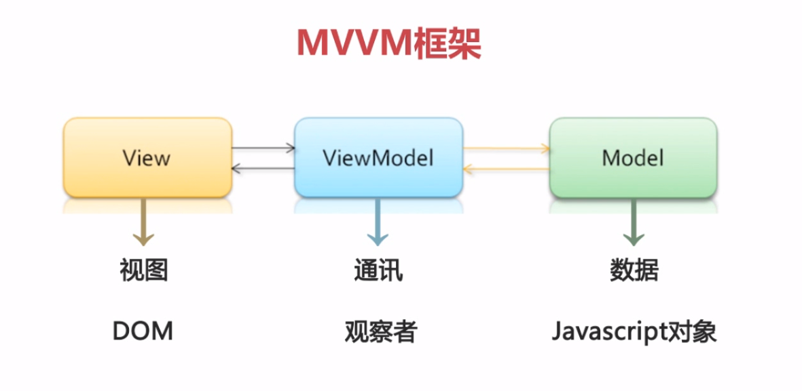
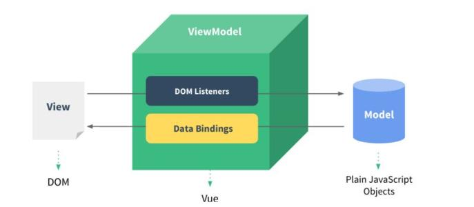
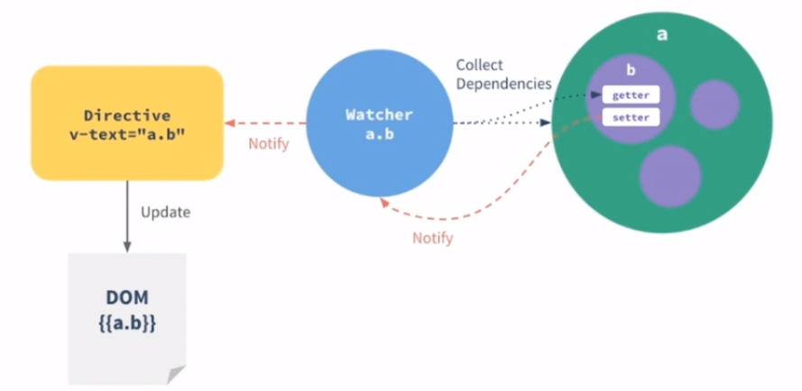
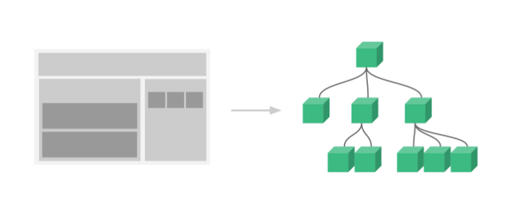

###   MVVM 框架

- 针对具有复杂交互逻辑的前端应用
- 提供基础的架构抽象
- 通过 ajax 数据持久化,保证前端用户体验

> Angular/React/Vue 都是使用了 MVVM 框架

### Vue

- Vue 在 2014 年开源,起初定位并不是框架,而是一个视图层库
- 它是一个轻量级 MVVM 框架
- 核心思想:数据驱动 + 组件化的前端开发
- Github 超过 25k+ 的 star,社区完善
- 三大框架(Vue/Angular/React)进行对比
  - gzip 大小的对比:
    - Vue.js 更轻量,gzip 后大小只有 20K+
    - Angular gzip 后大小 56k+
    - React gzip 后大小 44k+
  - 上手速度:
    - Vue.js 更易上手,学习曲线平稳
    - Angular 入门最难,概念过多,完全颠覆之前前端的模式和思维(Java 工程师所写)
    - React 相对于 Angular 会好一些,有自己的 JS 语法,学习曲线比较陡峭
  - Vue.js 吸取两家之长,借鉴了 angular 的指令和 react 的组件化
- Vue.js 核心思想
  - 数据驱动
    - DOM 是数据的一种自然映射
    
    - 数据响应原理
      - 数据(model)改变驱动视图(view)自动更新
      
  - 组件化
    - 扩展 HTML 元素,封装可重用的代码
    
  - 组件设计原则
    - 页面上每个独立的可视/可交互区域视为一个组件
    - 每个组件对应一个工程目录,组件所需要的各种资源在这个目录下就近维护
    - 页面不过是组件的容器,组件可以嵌套只有组合形成完整的页面
