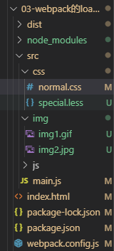
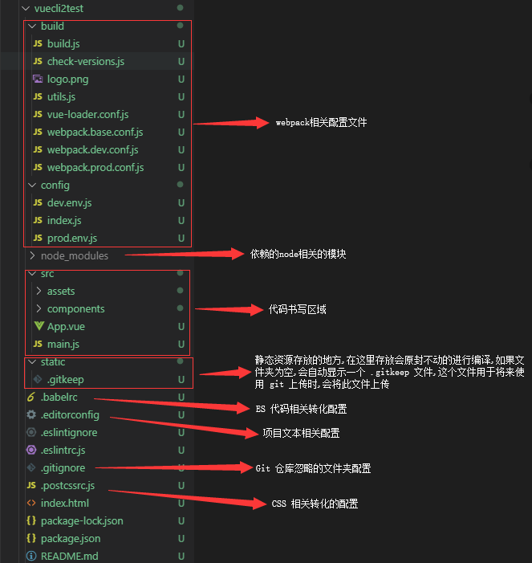
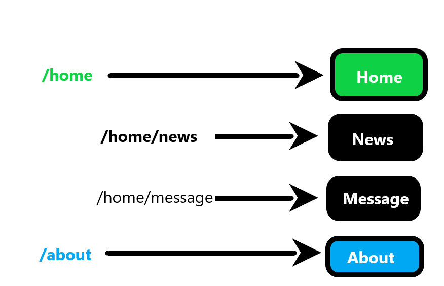

#### 简单认识一下 Vue.js

- Vue 是一个渐进式的框架
    - 渐进式意味着你可以将 Vue 作为 应用中的一部分嵌入其中,带来更丰富的交互体验.
    - 或者如果希望将更多的业务逻辑使用  Vue 实现,那么 Vue 的核心库以及其生态系统.
    - 比如 Core + Vue-router + Vuex,也可以满足各种各样的需求.

- Vue 有很多特点和 Web 开发中常见的高级功能
    - 解耦视图和数据
    - 可复用的组件
    - 前端路由技术
    - 状态管理
    - 虚拟 DOM

#### Vue.js 安装

- 直接 CDN 引入
    - 可以选择引入开发环境版本还是生产环境版本
    ```

        <!-- 开发环境版本,包含了有帮助的命令行警告 -->
        <script src="https://cdn.jsdelivr.net/npm/vue/dist/vue.js"></script>
        <!-- 生产环境版本,优化了尺寸和速度 -->
        <script src="https//cdn.jsdelivr.net/npm/vue"></script>

    ```

- 下载和引入
    ```

        <!-- 开发环境 -->
        https://vuejs.org/js/vue.js
        <!-- 生产环境 -->
        https://vuejs.org/js/vue.min.js

    ```

- npm 安装

#### Hello Vuejs

- 创建 Vue 对象的时候,传入了一些 options:{}
    - ``` {} ``` 中包含了 el 属性:该属性决定了这个 Vue 对象挂载到哪一个元素上.
    - ``` {} ``` 中包含了 data 属性:该属性中通常会存储一些数据
        - 这些数据可以是直接定义出来的 
        - 也可能是来自网络,从服务器加载出来的

#### 案例:计数器

- methods 属性,该属性用于在 Vue 对象中定义方法

- @click 指令:该指令用于监听某个元素的点击事件,并且需要指定当发生点击时,执行的方法(方法通常是 methods 中定义的方法)

#### Vue 中的 MVVM

[维基百科 MVVM(需翻墙)](https://zh.wikipedia.org/wiki/MVVM)

**MVVM(Model-view-viewmodel)** 是一种软件架构模式.

MVVM 有助于将图形用户界面的开发与业务逻辑或后端逻辑（数据模型）的开发分离开来，这是通过置标语言或GUI代码实现的。MVVM的视图模型是一个值转换器,这意味着视图模型负责从模型中暴露（转换）数据对象，以便轻松管理和呈现对象。在这方面，视图模型比视图做得更多，并且处理大部分视图的显示逻辑。视图模型可以实现中介者模式，组织对视图所支持的用例集的后端逻辑的访问。

MVVM是马丁·福勒的PM（Presentation Model）设计模式的变体。MVVM以相同的方式抽象出视图的状态和行为,但PM以不依赖于特定用户界面平台的方式抽象出视图（创建了视图模型）。

MVVM和PM都来自MVC模式。

MVVM由微软架构师Ken Cooper和Ted Peters开发，通过利用WPF（微软.NET图形系统）和Silverlight（WPF的互联网应用派生品）的特性来简化用户界面的事件驱动程序设计。微软的WPF和Silverlight架构师之一John Gossman于2005年在他的博客上发表了MVVM。

MVVM也被称为model-view-binder，特别是在不涉及.NET平台的实现中。ZK（Java写的一个Web应用框架）和KnockoutJS（一个JavaScript库）使用model-view-binder。

- MVVM 模式的组成部分
    - 模型
        - 模型是指代表真实状态内容的领域模型（面向对象），或指代表内容的数据访问层（以数据为中心）。
    - 视图
        - 就像在MVC和MVP模式中一样，视图是用户在屏幕上看到的结构、布局和外观（UI）。
    - 视图模型
        - 视图模型是暴露公共属性和命令的视图的抽象。MVVM没有MVC模式的控制器，也没有MVP模式的presenter，有的是一个绑定器。在视图模型中，绑定器在视图和数据绑定器之间进行通信。
    - 绑定器
        - 声明性数据和命令绑定隐含在MVVM模式中。在Microsoft解决方案堆中，绑定器是一种名为XAML的标记语言。绑定器使开发人员免于被迫编写样板式逻辑来同步视图模型和视图。在微软的堆之外实现时，声明性数据绑定技术的出现是实现该模式的一个关键因素。

- MVVM 的理论基础
    - MVVM旨在利用WPF中的数据绑定函数，通过从视图层中几乎删除所有GUI代码（代码隐藏），更好地促进视图层开发与模式其余部分的分离。不需要用户体验（UX）开发人员编写GUI代码，他们可以使用框架标记语言（如XAML），并创建到应用程序开发人员编写和维护的视图模型的数据绑定。角色的分离使得交互设计师可以专注于用户体验需求，而不是对业务逻辑进行编程。这样，应用程序的层次可以在多个工作流中进行开发以提高生产力。即使一个开发人员在整个代码库上工作，视图与模型的适当分离也会更加高效，因为基于最终用户反馈，用户界面通常在开发周期中经常发生变化，而且处于开发周期后期。
    - MVVM模式试图获得MVC提供的功能性开发分离的两个优点，同时利用数据绑定的优势和通过绑定数据的框架尽可能接近纯应用程序模型。它使用绑定器、视图模型和任何业务层的数据检查功能来验证传入的数据。结果是模型和框架驱动尽可能多的操作，消除或最小化直接操纵视图的应用程序逻辑（如代码隐藏）。


- View 层
    - 视图层
    - 在前端开发中,通常就是 DOM 层
    - 主要的作用是给用户展示各种信息

- Model 层
    - 数据层 
    - 数据可能是固定的死数据,更多的是来自服务器,从网络上请求下来的数据

- ViewModel 层
    - 视图模型层
    - 视图模型层是 View 和 Model 沟通的桥梁
    - 一方面它实现了 Data Binding,也就是数据绑定,将 Model 的改变实时的反应到 View 中
    - 另一方面它实现了 DOM Listener,也就是 DOM 监听,当 DOM 发生一些事件(点击、滚动、touch 等)时,可以监听到,并在需要的情况下改变对应的 Data

#### 创建 Vue 实例传入的 options

[详细解析](https://cn.vuejs.org/v2/api/#%E5%85%A8%E5%B1%80%E9%85%8D%E7%BD%AE)

- el:
    - 类型:string | HTMLElement
    - 作用:决定之后 Vue 实例会管理哪一个 DOM 

- data:
    - 类型:object | Function(组件当中 data 必须是一个函数)
    - 作用:Vue 实例对应的数据对象

- methods:
    - 类型:{[key:string]:Function}
    - 作用:定义属于 Vue 的一些方法,可以在其他地方调用,也可以在指令中使用

```

javascript 中函数和方法有什么不同?
函数(function):函数是带有名称(named)和参数的 JavaScript 代码段,可以一次定义多次调用.
方法(method):当将函数和对象合写在一起时,函数就变成了"方法"(method).当函数赋值给对象的属性,就称之为"方法".
也就是函数和方法本质上是一样的,只不过方法是函数的特例,是将函数赋值给了对象.

```

#### Vue 的生命周期

<div style='display:flex'>
    
    
</div>

#### Mustache 的语法

- Mustache 语法:也就是双大括号
- Mustache 语法中,不仅仅可以直接写变量,也可以写简单的表达式

#### v-once 指令

- 该指令后面不需要跟任何表达式(比如之前的 v-for 后面是由跟表达式的)
- 该指令表示元素和组件只渲染一次,不会随着数据的改变而改变

#### v-html 指令

- 该指令后面往往会跟上一个 string 类型
- 会将 string 的 html 解析出来并且进行渲染

#### v-text 指令

- v-text 指令作用和 Mustache 比较相似:都是用于将数据显示在界面中
- v-text 通常情况下,接受一个 string 类型

#### v-pre 指令

v-pre 指令用于跳过这个元素和它子元素的编译过程,用于显示原本的 Mustache 语法.

#### v-cloak 指令

v-cloak 指令是防止页面加载时出现 vuejs 的变量名而设计的.

```

<!-- html -->
<div v-cloak>
  {{ message }}
</div>
<!-- css -->
[v-cloak] {
  display: none;
}

```

#### v-bind 指令

- 作用:动态绑定属性
- 缩写: ``` : ```
- 预期: any(with argument) | Object(without argument)
- 参数: attrOrProp(optional)
- v-bind 用于绑定一个或多个属性值,或者向另一个组件传递 props 值

#### v-bind 绑定 class 

- 绑定 class 有两种方式:
    - 对象语法
        - 对象语法的含义是: class 后面跟的是一个对象
        ```

            <!-- 用法一:直接通过 {} 绑定一个类 -->
            <h2 :class="{'active': isActive}">Hello World</h2>
            
            <!-- 用法二:也可以通过判断,传入多个值 -->
            <h2 :class="{'active': isActive,'line': isLine}">Hello World</h2>

            <!-- 用法三:和普通的类同时存在,并不冲突 -->
            <!-- 注:如果 isActive 和 isLine 都为 true,那么会有 title/active/line 三个类 -->
            <h2 class="title" :class="{'active': isActive,'line': isLine}">Hello World</h2>

            <!-- 用法四:如果过于复杂,可放在一个 methods 或者 computed 中 -->
            <!-- 注:classes 是一个计算属性 -->
            <h2 class="title" :class="classes">Hello World</h2>

        ```
    - 数组语法
        - 数组语法的含义是:class 后面跟的是一个数组
        ```

            <!-- 用法一:直接通过 [] 绑定一个类 -->
            <h2 :class="['active']">Hello World</h2>

            <!-- 用法二:也可以传入多个值 -->
            <h2 :class="['active', 'line']">Hello World</h2>

            <!-- 用法三:和普通的类同时存在,并不冲突 -->
            <!-- 注:会有 title/active/line 三个类 -->
            <h2 class="title" :class="['active', 'line']">Hello World</h2>

            <!-- 用法四:如果过于复杂,可以放在一个 methods 或者 computed 中 -->
            <!-- 注: classes 是一个计算属性 -->
            <h2 class="title" :class="classes">Hello World</h2>

        ```

#### v-bind 绑定 style

- 可以利用 v-bind:style 来绑定一些 CSS 内联样式
- 在写 CSS 属性名的时候,比如 font-size
    - 可以使用驼峰式(camelCase):fontSize
    - 或短横线分割(kebab-case,记得用单引号括起来):'font-size'
- 绑定 class 有两种方式:
    - 对象语法
        ``` :style="{color: currentColor, fontSize: fontSize + 'px'}" ```
        - style 后面跟的是一个对象类型
            - 对象的 key 是 CSS 属性名称
            - 对象的 value 是具体赋的值,值可以来自于 data 中的属性
    - 数组语法
        ``` <div v-bind:style="[baseStyle, overridingStyles]"></div> ```
        - style后面跟的是一个数组类型
            - 多个值以 ``` , ``` 分割即可

## js 循环遍历

### 传统 for 循环

```

var arr = [1, 2, 3]
//遍历数组
for(let i = 0;i < arr.length;i++){
    console.log(arr[i])      //1, 2, 3
}

```

标准的 for 循环中 i 是 number 类型的，可以使用 break, continue 语句

**缺点**:这种方式写法比较麻烦,且不方便于遍历对象

### for in

```

//遍历数组
let arr = [1, 2, 3]
for(let i in arr){
    console.log(arr[i])      //1, 2, 3
}

```

- for in 这种循环 i 是 string 类型的
- 作用于数组的 for-in 循环体除了遍历数组元素外,还会自身可枚举属性
- 如果给对象的原型加上方法,for in 这种循环会把数组原型链上的属性都能被访问
- 在某些情况下,这段代码可能按照随机顺序遍历数组元素
- 简而言之,for-in 是为普通对象设计的,可以遍历得到字符串类型的键,因此不适用于数组遍历

```

//循环数组
var arr = [1, 2, 3]
Array.prototype.test=function(){}
arr.name='jq'
for(var i in arr){
  console.log(typeof i);//"string"
  console.log(i);//"0","1","2","name","test"
  console.log(arr[i]);//1,2,3,jq,ƒ (){} 
}

//循环json
var arr = [1, 2, 3]
Object.prototype.aa=function(){}
var json={'name':111}
for(var i in json){
  console.log(i);//"name","aa"
 console.log(json[i])；//111,ƒ (){}
}

```

### forEach 循环

forEach方法对数组的每个元素执行一次提供的函数,是es5操作数组的一种方法。

```

var arr = [1, 2, 3]
arr.forEach((data)=>{
    console.log(data)      //1, 2, 3
})

```

**缺点**:无法中途跳出 forEach 循环,continue、break 命令或 return 命令都不能奏效

### ES6 for-of 循环

for...of 允许遍历获得键值.

for...of 循环内部调用的是数据结构的 Symbol.iterator 方法.

```

var arr = [1, 2, 3]
for (let a of arr) {
  console.log(a); //1，2，3
}

```

**优点**:
- 有着同for...in一样的简洁语法，只返回具有数字索引的属性,没有for...in那些缺点。
- 不同用于forEach方法，它可以与break、continue和return配合使用。
- 提供了遍历所有数据结构的统一操作接口。
- for...of循环可以使用的范围包括数组、Set 和 Map 结构、某些类似数组的对象（比如arguments对象、DOM NodeList 对象）、后文的 Generator 对象，以及字符串。

#### 计算属性的 setter 和 getter

- 每计算属性都包含一个 getter 和 一个 setter
    - 一般情况下都是使用 getter 来进行读取
    - 在某些特殊的情况下,也可以提供一个 setter 方法
    - 在需要写 setter 的时候,代码如下
    ```

        <div id="app">
            <div>{{fullName}}</div>
            <div>{{firstName}}</div>
            <div>{{lastName}}</div>
        </div>

        <script src="./js/vue.js"></script>
        <script>
            const vm = new Vue({
                el: "#app",
                data(){
                    return{
                        firstName: "Kobe",
                        lastName: "Bryant"
                    }
                },
                computed:{
                    fullName:{
                        get(){
                            console.log("-----调用了 fullName 的 get")
                            return this.fristName + " " + this.lastName
                        },
                        set(){
                            console.log("-----调用了 fullName 的 set")
                            const names = newValue.split(" ")
                            this.firstName = names[0]
                            this.lastName = names[1]
                        }
                    }
                }
            })
        </script>

    ```

#### 计算属性的缓存

- methods 和 computed 都可以实现计算的功能
- 计算属性会进行缓存,如果多次使用时,计算属性只会调用一次

#### let/var

- 事实上 var 的设计可以看出 JavaScript 语言设计上的错误,但是这种错误多半不能修复和移除,以为需要向后兼容
    - 大概十年前,Brendan Eich 就决定修复这个问题,于是他添加了一个新的关键字:let
    - 可以将 let 看成更完美的 var

- 块级作用域
    - JS 中使用 var 来声明一个变量时,变量的作用域主要是和函数的定义有关
    - 针对于其他块定义来说是没有作用域的,比如 if/for 等,这在开发中会引起一些问题

```

// 监听按钮的点击
var btns = document.getElementsByTagName("button")
for(var i = 0; i < btns.length; i++){
    (function(i){
        btns[i].onclick = function(){
            alert("点击了" + i + "个")
        }
    })(i)
}

```

```

let btns = document.getElementsByTagName("button")
for(let i = 0; i < btns.length; i++){
    btns[i].onclick = function(){
        alert("点击了" + i + "个")
    }
}

```

#### const 的使用

- const 关键字
    - 在很多语言中已经存在,比如 C/C++ 中,主要的作用是将某个变量修饰为常量
    - 在 JavaScript 中也是如此,使用 const 修饰的标识符为常量,不可以再次赋值
- 当修饰的标识符不会被再次赋值时,就可以使用 const 来保证数据的安全性
- const 的注意
    - 注意一:
    ```

        const a = 20;
        a = 30;     // 错误:不可修改

    ```
    - 注意二:
    ```

        const name;     // 错误:const 修饰的标识符必须赋值

    ```
**建议:在开发中,优先使用 const,只有需要改变某一个标识符的时候才使用 let.(swift 语言中(iSO 的新语言):let(常量)/var(变量))**

#### 对象的增强写法

- ES6 中,对对象字面量进行了很多增强
- 属性初始化简写和方法的简写:

```

    // 1.属性的简写
    // ES6 之前
    let name = "why"
    let age = 18
    let obj1 ={
        name: name,
        age: age
    }
    console.log(obj1);

    // ES6 之后
    let obj2 = {
        name, age
    }
    console.log(obj2)

```

```

    // 2.方法的简写    
    // ES6 之前
    let obj1 = {
        test: function(){
            console.log("obj1 的 test 函数");
        }
    }
    obj1.test()

    // ES6 之后
    let obj2 = {
        test(){
            console.log("obj2 的 test 函数")
        }
    }
    obj2.test()

```

**字面量表示如何表达这个值，一般除去表达式，给变量赋值时，等号右边都可以认为是字面量。字面量分为字符串字面量(string literal )、数组字面量(array literal)和对象字面量(object literal)，另外还有函数字面量(function literal)。**

#### 事件监听

- 在前端开发中,需要经常和用户交互
    - 这个时候,就必须监听用户发生的时间,比如点击、拖拽、键盘事件等等
    - 在 Vue 中可以使用 v-on 指令监听事件
- v-on 介绍
    - 作用：绑定时间监听器
    - 缩写：``` @ ```
    - 预期: Function | Inline Statement | Object
    - 参数: event

#### v-on 基础

- 这里,用一个监听按钮的点击事件,来看 v-on 的使用
    - 下面的代码中,使用 ``` v-on:click="counter++" ```
    - 另外,可以将事件指向一个在 ``` methods ``` 中定义的函数
    ```

        // 注:v-on 也有对应的语法糖:可以将 v-on:click 写成 @click

        <div id="app">
            <h2>{{counter}}</h2>
            <button v-on:click="increment">+</button>
            <button @click="decrement">-</button>
        </div>
        <script src="./js/vue.js"></script>
        <script>
            const vm = new Vue({
                el: "#app",
                data(){
                    return{
                        counter: 0
                    }
                },
                methods:{
                    increment(){
                        this.counter++
                    },
                    decrement(){
                        this.counter--
                    }
                }
            })
        </script>

    ```

#### v-on 的参数

- 当通过 ``` methods ``` 中定义方法,以供 ``` @click ``` 调用时,需要注意参数问题
- 情况一:如果该方法不需要额外参数,那么方法后的 ``` () ``` 可以不添加
    - 但是注意:如果方法本身中有一个参数,那么会默认将原生事件 event 参数传递进去
- 情况二:如果需要同时传入某个参数,同时需要 event 时,可以通过 $event 传入事件
```

    <div id="app">
            <h2>点击次数:{{counter}}</h2>
            <button @click="handleAdd">+1</button>
            <button @click="handleTen(10, $event)">+10</button>
        </div>
        <script src="./js/vue.js"></script>
        <script>
            const vm = new Vue({
                el: "#app",
                data(){
                    return{
                        counter: 0
                    }
                },
                methods:{
                    handleAdd(event){
                        console.log(event)
                        this.counter++
                    },
                    handleTen(10, event){
                        console.log(event)
                        this.counter += 10
                    }
                }
            })
        </script>

```

#### v-on 修饰符

- 在某些情况下,拿到 event 的目的可能是进行一些事件处理
- Vue 提供了修饰符来帮助方便的处理一些事件:
    - .stop ———— 调用 event.stopPropagation()
    - .prevent ———— 调用 event.preventDefault()
    - .{ keyCode | keyAlias } ———— 只当事件是从特定键触发时才触发回调
    - .native ———— 监听组件根元素的原生事件
    - .once ———— 只触发一次回调
    ```

        <!-- 停止冒泡 -->
        <button @click.stop="doThis"></button>

        <!-- 阻止默认行为 -->
        <button @click.prevent="doThis"></button>

        <!-- 阻止默认行为,没有表达式 -->
        <form @submit.prevent></form>

        <!-- 串联修饰符 -->
        <button @click.stop.prevent="doThis"></button>

        <!-- 键修饰符,键别名 -->
        <input @keyup.enter="onEnter">

        <!-- 键修饰符,键代码 -->
        <input @keyup.13="onEnter">

        <!-- 点击回调只会触发一次 -->
        <button @click.once="doThis"></button>

    ```

#### v-if、v-else-if、v-else

- v-if、v-else-if、v-else
    - 这三个指令与 JavaScript 的条件语句 if、else、else if 类似
    - Vue 的条件指令可以根据表达式的值在 DDOM 中渲染或销毁元素或组件
- v-if 的原理
    - v-if 后面的条件为 false时,对应的元素以及其子元素不会渲染
    - 也就是根本没有不会有对应的标签出现在 DOM 中

#### v-if、v-else-if、v-else 切换涉及 input 框复用问题

- 小问题:
    - 如果在输入内容的情况下,切换了类型,会发现文字依然显示之前的输入内容,但是确实是切换到了另一个 input 元素中,在这个 input 元素中并没有输入内容,为什么会出现这个问题?
- 问题解答:
    - 1.这是因为 Vue 在进行 DOM 渲染时,出于性能考虑,会尽可能的复用已经存在的元素,而不是重新创建新的元素;
    - 2.在上面的案例中,Vue 内部会发现原来的 input 元素不在使用,直接作为 else 中的 input 来使用了
- 解决方案:
    - 如果不希望 Vue 出现类似重复利用的问题,可以给对应的 input 添加 key,并且需要保证 key 的不同,即不在复用,如 key 相同,即为复用.

#### v-show 

- v-show 的用法和 v-if 非常相似,也用于决定一个元素是否渲染
- v-if 和 v-show 对比
    - v-if 当条件为 false 时,压根不会有对应的元素在 DOM 中
    - v-show 当条件为 false 时,仅仅是将元素的 display 属性设置为 none 而已
- 在开发中应当如何选择:
    - 当需要在显示和隐藏之间切换频繁时,使用 v-show
    - 当只有一次切换时,通过使用 v-if

#### v-for 遍历数组

- 当有一组数据需要进行渲染时,可以使用 v-for 来完成
    - v-for 的语法类似于 JavaScript 中的 for 循环
    - 格式:v-for="(item, index) in items"
        - 其中的 index 就代表了取出的 item 在原数组的索引值
        - 其中的 item 则是被迭代的数组元素的别名

#### 组件的 key 属性

- 官方推荐在使用 v-for 时,给对应的元素或组件添加上一个:key 属性
- 为什么需要这个 key 属性呢?
    - 这个其实和 Vue 的虚拟 DOM 的 Diff 算法有关系
    
    

- 当某一层有很多相同的节点时,也就是列表节点时,如若希望插入一个新的节点
    - 如果希望可以在 B 和 C 之间加一个 F,Diff 算法默认执行起来是这样的

    

    - 即把 C 更新成 F,D 更新成 C,E 更新成 D,最后再插入 E,这样是不是没有效率

    

- 所以需要使用 key 来给每个节点做一个唯一标识
    - Diff 算法就可以正确的识别此节点
    - 找到正确的位置区插入新的节点
- 所以说,key 的作用主要是为了高效的更新虚拟 DOM 


#### 检测数组更新

- 因为 Vue 是响应式的,所以当数据发生变化时,Vue 会自动检测数据变化,视图会发生对应的更新
- Vue 中包含了一组观察数组编译的方法,使用它们改变数组也会触发视图的更新
    - push()
    ```

        <!-- push方法(响应式):可向数组的末尾添加一个或多个元素 -->
        this.letters.push('1')

    ```
    - pop()
    ```

        <!-- pop方法(响应式):删除数组的最后一个元素 -->
        this.letters.pop()

    ```
    - shift()
    ```

        <!-- shift方法(响应式):删除数组的第一个元素 -->
        this.letters.shift()

    ```
    - unshift()
    ```

        <!-- unshift方法(响应式):向数组的开头添加一个或更多元素 -->
        this.letters.unshift("4")

    ```
    - splice()
    ```

        <!-- splice方法(响应式):删除元素/插入元素/替换元素 -->
        this.letters.splice(2, 0, '5')

    ```
    - sort()
    ```

        <!-- sort方法(响应式):对数组的元素进行排序 -->
        this.letters.sort()

    ```
    - reverse()
    ```

        <!-- reverse方法(响应式):颠倒数组中元素的顺序 -->
        this.letters.reverse()

    ```
    - Vue.set()
    ```

        <!-- Vue 的 set 方法(响应式):可以修改指定的值 -->
        <!-- set(要修改的对象, 索引值, 修改后的值) -->
        Vue.set(this.letters, 0, '8')

    ```

#### 表单绑定 v-model

- 表单控件在实际开发中是非常常见的,特别是对于用户信息的提交,需要大量的表单
- Vue 中使用 v-model 指令来实现表单元素和数据的双向绑定
- 当然,也可以将 v-model 用于 textarea 元素中
- v-model 绑定后,会实时将输入的内容传递给 data 中的元素,使得元素发生改变,当元素改变的时候,因为使用 Mustache 语法,将元素的值插入到 DOM 中,所以 DOM 会发生响应的改变,所以就通过 v-model 实现的数据的双向绑定.

#### v-model 原理 

- v-model 其实是一个语法糖,它的背后本质上是包含两个操作:
    - v-bind 绑定一个 value 属性
    - v-on 指令给当前元素绑定 input 事件
- 也就是说下面的代码:等同于下面的代码
```

    <input type="text" v-model=message>
    <!-- 等同于 -->
    <input type="text" :value="message" @input="message = $event.target.value">

```

#### v-model:radio

- radio 中使用 ``` v-model ``` 时,就不需要 ``` name ``` 来设置单选

```

<div id="app">
    <label for="male">
        <input type="radio" id="male" value="男" v-model="sex">男
    </label>
    <label for="female">    
        <input type="radio" id="female" value="女" v-model="sex">女
    </label>
    <label for="unknown">    
        <input type="radio" id="unknown" value="未知" v-model="sex">未知
    </label>
    <h2>你选择的性别是:{{sex}}</h2>
</div>
<script src="./js/vue.js"></script>
<script>
    const vm = new Vue({
        el: "#app",
        data(){
            return{
                sex: '未知'
            }
        }
    })
</script>

```

#### v-model:checkbox

- 复选框分为两种情况:单个勾选框和多个勾选框
    - 单个勾选框
        - v-model 即为布尔值
        - 此时 input 的 value 并不影响 v-model 的值
    - 多个复选框
        - 当时多个复选框时,因为可以选中多个,所以对应的 data 中属性是一个数组
        - 当选中某一个时,就会将 input 的 value 添加到数组中

```

    <div id="app">
        <!-- checkbox 单选框:对应的值是布尔值 -->
        <label for="agree">
            <input type="checkbox" id="agree" v-model="isAgree">同意协议
        </label>
        <h2>你选择的是:{{isAgree}}</h2>
        <button :disabled=!isAgree>下一步</button>
        <br>
        <!-- checkbox 多选框:对应的值是数组 -->
        <input type="checkbox" value="篮球" v-model="hobbies">篮球
        <input type="checkbox" value="足球" v-model="hobbies">足球
        <input type="checkbox" value="乒乓球" v-model="hobbies">乒乓球
        <input type="checkbox" value="羽毛球" v-model="hobbies">羽毛球
        <h2>你的爱好是:{{hobbies}}</h2>
    </div>
    <script src="./js/vue.js"></script>
    <script>
        const vm = new Vue({
            el: "#app",
            data(){
                return{
                    isAgree: false,
                    hobbies: []
                }
            }
        })
    </script>

```

#### v-model:select

- select 和 checkbox 一样,也分单选和多选两种情况
- 单选:只能选中一个值
    - v-model 绑定的是一个值
    - 当选中 option 中的一个时,会将它对应的 value 赋值到 mySelect 中
- 多选:可以选中多个值
    - v-model 绑定的是一个数组
    - 当选中多个值时,就会将选中的 option 对应的 value 添加到数组 mySelects 中

```

    <div id="app">
        <!-- 1.选择一个 -->
        <select name="fruits" id="" v-model="mySelect">
            <option value="苹果">苹果</option>
            <option value="香蕉">香蕉</option>
            <option value="橘子">橘子</option>
        </select>
        <h2>你最喜欢的水果是:{{mySelect}}</h2>

        <!-- 2.选择多个 -->
        <select name="fruits" id="" v-model="mySelects" multiple>
            <option value="苹果">苹果</option>
            <option value="香蕉">香蕉</option>
            <option value="橘子">橘子</option>
        </select>
        <h2>你最喜欢的水果是:{{mySelects}}</h2>
    </div>
    <script src="./js/vue.js"></script>
    <script>
        const vm = new Vue({
            el: "#app",
            data(){
                return{
                    mySelect: "苹果",
                    mySelects: []
                }
            }
        })
    </script>

```

#### v-model值绑定

- 通过 ``` v-bind:value ``` 动态的给 value 绑定值

```

    <div id="app">
        <label v-for="item in ball" :for="item">
            <input type="checkbox" :id="item" :value="item" v-model="ballList">{{item}}
        </label>
        <h2>你最喜欢玩的球是:{{ballList}}</h2>
    </div>
    <script src="./js/vue.js"></script>
    <script>
        const vm = new Vue({
            el: "#app",
            data(){
                return{
                    ball: ["篮球", "足球", "乒乓球", "羽毛球", "台球", "高尔夫球", "橄榄球", "冰球"],
                    ballList: []
                }
            }
        })
    </script>

```

#### 修饰符

- lazy 修饰符:
    - 默认情况下,v-model 默认是在 input 事件中同步输入框的数据的
    - 也就是说,一旦有数据发生改变对应的 data 中的数据就会自动发生改变
    - lazy 修饰符可以让数据在失去焦点或者回车时才会更新
- number 修饰符:
    - 默认情况下,在输入框中无论输入的是字母还是数字,都会被当做字符串类型进行处理
    - 但是如果希望处理的是数字类型,那么最好直接将内容当做数字处理
    - number 修饰符可以让在输入框中输入的内容自动转成数字类型
- trim 修饰符:
    - 如果输入的内容首尾有很多空格,通过希望将其去除
    - trim 修饰符可以过滤内容左右两边的空格

#### JavaScript 高阶函数的使用

- 一种编程范式:命令式编程/声明式编程
- 另一种编程范式:面向对象编程(第一公民:对象)/函数式编程(第一公民:函数)

```

const nums = [10, 20, 111, 222, 444, 40, 50]

let total = nums.filter(function(n){
    return n < 100
}).map(function(n){
    return n * 2
}).reduce(function(preValue, n){
    return preValue + n
},0)

// 1.取出所有小于 100 的数字
let newNums = []
for(let n of nums){
    if(n < 100){
        newNums.push(n)
    }
}

// filter 中的回调函数有一个要求:必须返回一个 boolean 值
// true:当返回 true 时,函数内部会自动将这次回调的 n 加入到新的数组中
// false:当返回 false 时,函数内部会过滤掉这次的 n
let newNums = nums.filter(function(n){
    return n < 100
})

//2.将所有小于 100 的数字进行转化:全部乘以 2
let new2Nums = []
for(let n of newNums){
    new2Nums.push(n * 2)
}

// map 函数的使用
let new2Nums = newNums.map(function(n){
    return n*2
})

3.将 new2Nums 所有数字相加,得到最终的结果
let total = 0
for(let n of new2Nums){
    total += n
}

// reduce 函数的使用
// reduce 作用对数组中所有的内容进行汇总
let total = new2Nums.reduce(function(preValue, n){
    return preValue + n
},0)

```

#### 什么是组件化

- 人面对复杂问题的处理方式:
    - 任何一个人处理信息的逻辑能力都是有限的
    - 所以,当面对一个非常复杂的问题时,都不太可能一次性搞定一大堆的内容
    - 但是,人有一种天生的能力,就是将问题进行拆解
    - 如果将一个复杂的问题,拆分成很多个可以处理的小问题,再将其放在整体当中,就会发现大的问题也会迎刃而解
- 组件化也是类似的思想:
    - 如果将一个页面中所有的处理逻辑全部放在一起,处理起来就会变得非常复杂,而且不利于后续的管理以及拓展
    - 但如果,将一个页面拆分成一个个小的功能块,每个功能块完成属于自己这部分独立的功能,那么之后整个页面的管理和维护就变得非常容易

#### Vue 组件化思想

- 组件化是 Vue.js 中的重要思想
    - 它提供了一种抽象,使得我们可以开发出一个个独立复用的小组件来构造我们的应用
    - 任何的应用都会被抽象成一棵组件树

    
- 组件化思想的应用:
    - 有了组件化的思想,在之后的开发中就要充分的利用它
    - 尽可能的将页面拆分成一个个小的、可复用的组件
    - 组件可以使得代码更加方便组织和管理,并且扩展性也更强

#### 注册组件的基本步骤

- 组件的使用分成三个步骤:
    - 创建组件构造器
    - 注册组件
    - 使用组件

    

```

    <div id="app">
        <!-- 3.使用组件 -->
        <my-cpn></my-cpn>
    </div>

    <script src="./js/vue.js"></script>
    <script>
        // 1.创建组件构造器
        const myComponent = Vue.extend({
            template:`
                <div>
                    <h2>组件标题</h2>
                    <p>组件中的一个段落内容</p>
                </div>
            `
        })

        // 2.注册组件,并且定义组件标签的名称
        Vue.component("my-cpn", myComponent)

        let vm = new Vue({
            el: "#app"
        })
    </script>

```

#### 注册组件步骤解析

- 1.``` Vue.extend() ```:
    - 调用 ``` Vue.extend() ``` 创建的是一个组件构造器
    - 通常在创建组件构造器时,传入 ``` template ``` 代表自定义组件的模板
    - 该模板就是在使用到组件的地方,要实现的 HTML 代码
- 2.``` Vue.component() ```:
    - 调用 ``` Vue.component() ``` 是将刚才的组件构造器注册为一个组件,并且给它起一个组件的标签名称
    - 所以需要传递两个参数:注册组件的标签名和组件构造器
- 3.组件必须挂载在某个 Vue 实例下,否则不会生效

#### 全局组件和局部组件

- 当通过调用 ``` Vue.component() ``` 注册组件时,组件的注册是全局的
    - 这意味着该组件可以在任意 Vue 实例下使用
- 如果注册的组件是挂载在某个实例中,那么就是一个局部组件

```

    <div id="app">
        <cpn></cpn>
        <my></my>
    </div>
    <script src="./js/vue.js"></script>
    <script>
        // 1.创建组件构造器
        const myComponent = Vue.extend({
            template:`
                <div>
                    <h2>组件标题</h2>
                    <p>组件内容</p>
                </div>
            `
        })

        // 2.注册组件(全局组件,意味着可以在多个 Vue 实例下面使用)
        Vue.component('cpn', myComponent)

        const vm = new Vue({
            el: "#app",
            // 2.注册组件(局部组件)
            components:{
                // 组件名称:创建组件构造器时的命名
                my: myComponent
            }
        })
    </script>

```

#### 父组件和子组件

- 组件树:
    - 组件和组件之间存在层级关系
    - 而其中一种非常重要的关系就是父子组件的关系
- 父子组件错误用法
    - 因为当子组件注册到父组件的 ``` components ``` 时,Vue 会编译好父组件的模块
    - 该模板的内容已经决定了父组件将要渲染的 HTML(相当于父组件中已经有了子组件中的内容)
    - 子组件只能在父组件中被识别的

```

    <div id="app">
        <cpn2></cpn2>
    </div>
    <script src="./js/vue.js"></script>
    <script>
        // 1.创建第一个组件构造器(子组件)
        const cpnC1 = Vue.extend({
            template:`
                <div>
                    <h2>我是标题1</h2>
                    <p>我是内容,哈哈哈哈</p>
                </div>
            `
        })

        // 2.创建第二个组件构造器(父组件)
        const cpnC2 = Vue.extend({
            template:`
                <div>
                    <h2>我是标题2</h2>
                    <p>我是内容,呵呵呵呵</p>
                    <cpn1 />
                </div>
            `,
            components:{
                cpn1: cpnC1
            }
        })

        const app = new Vue({
            el: "#app",
            components:{
                cpn2: cpnC2
            }
        })
    </script>

```

#### 注册组件的语法糖

- 在上面注册组件的方法,可能会有些繁琐
    - Vue 为了简化这个过程,提供了注册的语法糖
    - 主要是省去了调用 ``` Vue.extend() ``` 的步骤,而是可以直接使用一个对象来代替
- 语法糖注册全局组件和局部组件

```

    <div id="app">
        <cpn1></cpn1>
        <cpn2></cpn2>
    </div>
    <script src="./js/vue.js"></script>
    <script>
        // 1.全局组件注册的语法糖
        // 1.创建组件构造器
        // 2.注册组件
        Vue.component("cpn1",{
            template:`
                <div>
                    <h2>我是标题1</h2>
                    <p>我是内容,哈哈哈哈</p>
                </div>
            `
        })

        const vm = new Vue({
            el: "#app",
            data(){
                return{

                }
            },
            components:{
                // 局部组件注册的语法糖
                "cpn2":{
                    template:`
                        <div>
                            <h2>我是标题2</h2>
                            <p>我是内容,呵呵呵呵</p>
                        </div>
                    `
                }
            }
        })
    </script>

```

#### 模板的分离写法

- Vue 提供了两种方案来定义 HTML 模块内容:
    - script 标签,注意:类型必须是 text/x-template,id 为标识符
    - template 标签,id 为标识符

```

    <div id="app">
        <cpn></cpn>
        <cpn2></cpn2>
    </div>
    <!-- 组件模板的分离写法一:script 标签,注意:类型必须是 text/x-template,id 为标识符 -->
    <script type="text/x-template" id="cpn">
        <div>
            <h2>我是标题1</h2>
            <p>我是内容,哈哈哈哈</p>
        </div>
    </script>
    <!-- 组件模板的分离写法二:template 标签,id 为标识符 -->
    <template id="cpn2">
        <div>
            <h2>我是标题2</h2>
            <p>我是内容,呵呵呵呵</p>
        </div>
    </template>
    <script src="./js/vue.js"></script>
    <script>
        // 1.注册一个全局组件
        Vue.component('cpn',{
            template:'#cpn'
        })

        const vm = new Vue({
            el: "#app",
            data(){
                return{

                }
            },
            // 2.注册一个局部组件
            components:{
                cpn2:{
                    template:'#cpn2'
                }
            }
        })
    </script>

```

#### 组件可以访问 Vue 实例数据吗?

- 组件是一个单独功能模块的封装
    - 这个模块有属于自己的 HTML 模板,也应该有属于自己的数据 data
- 组件中的数据是保存在哪里?顶层的 Vue 实例中吗?
    - 测试得出,组件不可以访问 Vue 实例数据,而且即使可以访问,如果将所有的数据都放在 Vue 实例中,Vue 实例就会变得非常臃肿
    - 结论:Vue 组件应该有自己保存数据的地方

#### 组件数据的存放

- 组件数据的存放
    - 组件对象也有一个 data 属性(也可以有 methods 等属性)
    - 只是这个 data 属性必须是一个函数
    - 而且这个函数返回一个对象,对象内部保存着数据

#### 父子组件的通信

- 在开发中,往往一些数据需要从上层传递到下层:
    - 在一个页面汇总,从服务器请求到了很多的数据
    - 其中一部分数据,并非是整个页面的父组件来展示的,而是需要下面的子组件进行展示
    - 这个时候,并不会让子组件再次发生一个网络请求,而是直接让父组件将数据传递给子组件
- Vue 进行父子组件间的通信
    - 通过 props 向子组件传递数据
    - 通过事件向父组件发送消息
- 在真实开发中,**Vue 实例和子组件的通信**和**父组件和子组件的通信**过程是一样的


#### props 基本用法

- 在组件中,使用选项 props 来声明需要从父级接收到的数据
- props 的值有两种方式
    - 方式一:字符串数组,数组中的字符串就是传递时的名称
    - 方式二:对象,对象可以设置传递时的类型,也可以设置默认值等
- 在 props 绑定父子传值数据的时候,使用驼峰标识,在父组件调用子组件传递数据时,驼峰标识要分离,因为 ``` v-bind ``` 不支持驼峰数据,如 ``` cInfo ``` 变为 ``` c-info ```

```

    <div id="app">
        <cpn :cmovies="movies"></cpn>
    </div>
    <template id="cpn">
        <div>
            <ul>
                <li v-for="item in cmovies">{{item}}</li>
            </ul>
        </div>
    </template>
    <script src="./js/vue.js"></script>
    <script>
        // 父组件传子组件: props
        const cpn = {
            template: "#cpn",
            props: ['cmovies']
        }

        const vm = new Vue({
            el: "#app",
            data(){
                return{
                    movies: ["海王", "海贼王", "海尔兄弟"]
                }
            },
            components:{
                cpn
            }
        })
    </script>

```

#### props 数据验证

- props 选项除了数组之外,也可以使用对象,当需要对 props 进行类型等验证时,就需要对象写法了
- props 验证支持的数据类型:
    - String
    - Number
    - Boolean
    - Array
    - Object
    - Date
    - Function
    - Symbol
- 当有自定义构造函数时,验证也支持自定义的类型

    ```

        Vue.component("my-component",{
            props:{
                // 基础的类型检查(`null`匹配任何类型)
                propsA: Number,
                // 多个可能的类型
                propsB: [String, Number],
                // 必填的字符串
                propsC:{
                    type: String,
                    required: true
                },
                // 带有默认值得数字
                propsD:{
                    type: Number,
                    default: 100
                },
                // 带有默认值的对象
                propsE:{
                    type: Object,
                    // 对象或数组默认值必须从一个工厂函数获取
                    default:function(){
                        return { message: "Hello" }
                    }
                },
                // 自定义验证函数
                propsF:{
                    validator:function(value){
                        // 这个值必须匹配下列字符串中的一个
                        return ["success", "warning", "danger"].indexOf(value) !== -1
                    }
                }
            }
        })

    ```

    ```

        <div id="app">
            <cpn :cmovies="movies" :cmessage="message"></cpn>
        </div>
        <template id="cpn">
            <div>
                <ul>
                    <li v-for="item in cmovies">{{item}}</li>
                </ul>
                <h2>{{cmessage}}</h2>
            </div>
        </template>
        <script src="./js/vue.js"></script>
        <script>
            // 父组件传子组件: props
            const cpn = {
                template: "#cpn",
                // props 数组
                // props: ['cmovies',"cmessage"]
                // props 对象
                props:{
                    // 1.类型的限制
                    // cmovies: Array,
                    // cmessage: String

                    // 2.提供一些默认值,以及必传值
                    cmessage:{
                        type: String,   // type 为设置属性,如果类型是对象或者数组时,默认值必须是一个函数
                        default: "Hello World",     // default 如果数据为空,显示的默认值
                        required: true  // required 设置为必须要传值
                    },
                    cmovies:{
                        type: Array,
                        default() {
                            return ["没有数据"]
                        }
                    }
                }
            }
    
            const vm = new Vue({
                el: "#app",
                data(){
                    return{
                        movies: ["海王", "海贼王", "海尔兄弟"],
                        message: "你好"
                    }
                },
                components:{
                    cpn
                }
            })
        </script>

    ```

#### 子组件向父组件传递

- props 用于父组件向子组件传递数据,还有一些比较常规的是子组件传递数据或事件到父组件中
- 当子组件需要向父组件传递数据时,就要用到自定义事件
- ``` v-on ``` 不仅仅可以用于监听 DOM 事件,也可以用于组件间的自定义事件
- 自定义事件的流程:
    - 在子组件中,通过 ``` $emit() ``` 来触发事件
    - 在父组件中,通过 ``` v-on ``` 来监听子组件事件

#### 父子组件的访问方式

- 有时候需要父组件直接访问子组件,子组件直接访问父组件,或者是子组件访问根组件
    - 父组件访问子组件:使用 ``` $children ``` 或 ``` $refs ```
    - 子组件访问父组件:使用 ``` $parent ```
- ``` $children ``` 的访问方式:
    - ``` this.$children ``` 是一个数组类型,它包含所有子组件对象
- ``` $refs ``` 的访问方式:
    - ``` this.$refs ``` 是一个对象类型,默认是一个空的对象,需要在被组件上加 ref="标识名"
- ``` $parent ``` 的访问方式:
    - ``` this.$parent ``` 是一个对象类型,但只能访问到自己的上层父组件
- ``` $root ``` 的访问方式:
    - ``` this.$root ``` 固定访问到根组件,不管这个子组件的父组件是否是根组件,都能直接访问到最外层的根组件

#### slot

- slot 翻译为插槽:
    - 在生活中很多地方都有插槽,电脑的 USB 插槽,插板当中的电源插槽
    - 插槽的目的是让原来的设备具有更多的扩展性
    - 比如电脑的 USB 可以插入 U 盘、硬盘、手机、音响、键盘、鼠标等
- 组件的插槽:
    - 组件的插槽也是为了让封装的组件更加具有扩展性
    - 让使用者可以决定组件内部的一些内容到底展示什么
- 如何封装这类的组件
    - 它们有很多区别,但是也有很多共性
    - 如果每一个单独去封装一个组件,这样显然不合适
    - 抽取共性,保留不同
    - 最好的封装方式就是将共性抽取到组件中,将不同暴露为插槽
    - 一旦预留了插槽,就可以让使用者根据自己的需求,决定插槽中插入什么内容
- 在子组件汇总,使用特殊元素 ``` <slot> ``` 就可以为子组件开启一个插槽,该插槽插入的内容取决于父组件如何使用
- ``` <slot> ``` 中有默认值,如果没有在该组件中插入任何其他内容,就默认显示该内容

#### 具名插槽 slot

- 当组件的功能复杂时,子组件的插槽可能并非是一个,这个时候就需要给插槽取一个名字
    - 只要给 slot 元素一个 name 属性即可
    - 在组件调用时给元素一个 slot="slot的name名" 即可插入指定的插槽

```

    <div id="app">
        <cpn>
            <span slot="center">标题</span>
        </cpn>
    </div>
    <template id="cpn">
        <div>
            <slot name="left">
                <span>左边</span>
            </slot>
            <slot name="center">
                <span>中间</span>
            </slot>
            <slot name="right">
                <span>右边</span>
            </slot>
        </div>
    </template>
    <script src="./js/vue.js"></script>
    <script>
        const app = new Vue({
            el: "#app",
            data(){
                return{
    
                }
            },
            components:{
                cpn:{
                    template: "#cpn"
                }
            }
        })
    </script>

```

#### 编译作用域 

- 父组件模板的所有东西都会在父级作用域内编译;子组件模板的所有东西都会在子级作用域内编译

#### 作用域插槽

- 父组件替换插槽的标签,但是内容由子组件来提供

```

    <div id="app">
        <cpn></cpn>
        <cpn>
            <!-- 目的是获取子组件中的 pLanguge,2.5以下版本必须使用 template,2.5以上没有要求 -->
            <template slot-scope="slot">
                <span v-for="item in slot.data">{{item}}-</span>
            </template>
        </cpn>
        <cpn>
            <div slot-scope="slot">
                <span v-for="item in slot.data">{{item}}-</span>
            </div>
        </cpn>
        <cpn>
            <div slot-scope="slot">
                <span>{{slot.data.join("-")}}</span>
            </div>
        </cpn>
    </div>
    
    <template id="cpn">
        <div>
            <!-- 这里的 :data 中的 data 可以换成其他名称,在组件调用中使用相对应的名称即可 -->
            <slot :data="pLanguge">
                <ul>
                    <li v-for="item in pLanguge">{{item}}</li>
                </ul>
            </slot>
        </div>
    </template>
    
    <script src="./js/vue.js"></script>
    <script>
        const vm = new Vue({
            el: "#app",
            data(){
                return{
                    message: "你好",
                }
            },
            components:{
                cpn:{
                    template: "#cpn",
                    data(){
                        return{
                            pLanguge: ["JavaScript", "C++", "JAVA", "C#", "Python", "Go", "Swift"]
                        }
                    }
                }
            }
        })
    </script>

```

#### JavaScript 原始功能

- 在网页开发的早期,js 制作作为一种脚本语言,做一些简单的表单验证或动画实现等,那时 js 代码还是很少的,只做简单操作
    - 那时候直接将代码写在 ``` <script> ``` 标签中即可
- 随着 ajax 异步请求出现,慢慢形成了前后端的分离
    - 客户端需要完成的事情越来越多,代码量也是与日俱增
    - 为了应对代码量的剧增,这时通常会将代码组织在多个 js 文件中,进行维护
    - 但是这种维护方式,依然不能避免一些灾难性的问题
- 另外,这种代码的编写方式对 js 文件的依赖顺序几乎是强制的
    - 但是当 js 文件过多时,弄清楚它们的顺序是一件比较头疼的事情
    - 而且即使弄清楚顺序了,也不能避免标签混用、命名重复的问题发生

#### 匿名函数解决代码冲突

- 使用匿名函数来解决方法的重名问题
- 如果在其他文件中需要使用某文件的变量,这是不可以的,因为匿名函数中的变量为局部变量
- 匿名函数虽然解决了方法重名的问题,但是带来了代码不可复用的问题

#### 使用模块作为出口解决代码复用

- 在匿名函数内部,定义一个对象,给对象添加各种需要暴露到外面的属性和方法(不需要暴露的直接定义即可),最后将这个对象返回,并且在外面使用一个模块名接受即可.
- 只需要在要使用的地方使用模块的属性和方法即可
- 这就是模块最基础的封装,事实上模块的封装还有很多高级的话题:
    - 这里就是要认识一下为什么需要模块,以及模块的原始雏形
    - 幸运的是,前端模块化开发已经有了很多既有的规范,以及对应的实现方法
- 常见的模块化规范:
    - CommonJs、AMD、CMD,也有 ES6 的 Modules

```

// index.js
var ModuleA = (function(){
    // 1.定义一个对象
    var obj = {}
    // 2.在对象内部添加变量和方法
    obj.flag = true
    obj.myFunc = function(info){
        console.log(info)
    }
    // 3.将对象返回
    return obj
})()

```

```

// main.js
if(ModuleA.flag){
    console.log("小明是天才")
}

ModuleA.myFunc("小明长得真帅")

console.log(ModuleA)

```

#### CommonJs

- 模块化有两个核心:导出和导入
- CommonJs 的导出:

```

module.exports = {
    flag: true,
    test(a, b){
        return a + b
    },
    demo(a, b){
        return a * b
    }
}

```

- CommonJs 的导入:

```

// CommonJS 模块
let { test, demo, flag } = require("moduleA");

//等同于
let _mA = require("moduleA");
let test = _mA.test;
let demo = _mA.demo;
let flag = _mA.flag;

```

#### export 基本使用

- export 指令用于导出变量,比如下面的代码:

```

// info.js
export let name = "why"
export let age = 18
export let height = 1.88

```

#### 导出函数或类

- 上面主要是输出变量,也可以输出函数或者输出类

```

export function test(content){
    console.log(content)
}

export class Person{
    constructor(name, age){
        this.name = name
        this.age = age
    }

    run(){
        console.log(this.name + "在奔跑)
    }
}

```

```

function test(content){
    console.log(content)
}

class Person{
    constructor(name, age){
        this.name = name
        this.age = age
    }

    run(){
        console.log(this.name + "在奔跑)
    }
}

export {test, Person}

```

#### export default 

- 某些情况下,一个模块中包含某个的功能,并不希望给这个功能命名,而且让导入者可以自己来命名
    - 这个时候就可以使用 export default

    ```

        // info.js
        export default function(){
            console.log("default function")
        }

    ```

- 来到需要使用的 js 页面中,进行命名就可以使用了

```

    // main.js
    import myFunc from "./info.js"

    myFunc()

```

- 另外,需要注意:
    - export default 在同一个模块中,不允许同时存在多个

#### import 使用

- export 指令导出了模块对外提供的接口,就可以通过 import 命令来加载对应的这个模块
- 首先,需要在 HTML 代码中引入两个 js 文件,并且类型需要设置为 ``` module ```

```

    <script src="info.js" type="module"></script>
    <script src="main.js" type="module"></script>

```

- import 指令用于导入模块中的内容,比如

```

// main.js
import {name, age, height} from "./info.js"

console.log(name, age, height)

```

- 如果希望某个模块中所有的信息都导入,那么一个个导入显得有些麻烦
    - 通过 ``` * ``` 可以导入模块中所有的 export 变量
    - 但是通常情况下需要给 ``` * ``` 起一个别名,方便后续的使用

```

// main.js
import * as info from "./info.js"

console.log(info.name, info.age, info.height)

```

### webpack

#### webpack 的介绍

- webpack 的介绍
    - At its core,webpack is a static module bundler for modern JavaScript applications.(从本质上来讲,webpack 是一个现代的 JavaScript 应用的静态模块打包工具)
    - 主要理解点为:模块和打包


#### 前端模块化

- 前端模块化:
    - 前端模块化的一些方案:AMD、 CMD、 CommonJS、 ES6
    - 在 ES6 之前,如果想进行模块化开发,就必须借助于其他的工具,使得可以进行模块化开发
    - 并且在通过模块化开发完成了项目后,还需要处理模块间的各种依赖,并且将其进行整合打包
    - 而 webpack 其中一个核心就是使得可以进行模块化开发,并且还会帮助处理模块间的依赖关系
    - 而且不仅仅是 JavaScript 文件,CSS、图片、 json 文件等等在 webpack 中都可以被当做模块来使用
    - 这些就是 webpack 中模块化的概念
- 打包:
    - 就是将 webpack 中各种资源模块进行打包合并成一个或多个包(Bundle)
    -  并且在打包的过程中,还可以对资源进行处理,比如压缩图片,将 scss 转成 css,将 ES6 语法转换成 ES5 语法,将 TypeScript 转成 JavaScript 等等操作

#### webpack 和 grunt/gulp 的对比

- grunt/gulp 的核心是 Task
    - 可以配置一系列的 task,并且定义 task 要处理的事务(例如 ES6、ts 转化,图片压缩, scss 转成 css)
    - 之后让 grunt/gulp 来依次执行这些 task,而且让整个流程自动化
    - 所以 grunt/gulp 也被称为前端自动化任务管理工具
- gulp 的 task 示例:
    - 下面的 task 就是将 src 下面的所有 js 文件转成 ES5 的语法
    - 并且最终输出到 dist 文件夹中

```

    const gulp = require("gulp")
    const babel = require("gulp-babel")
    gulp.task("js",()=>
        gulp.src("src/*.js")
            .pipe(babel({
                presets: ["es2015"]
            }))
            .pipe(gulp.dest("dist"))
    )

```

- 什么时候使用 grunt/gulp
    - 如果工程模块依赖非常简单,甚至没有用到模块化的概念
    - 只需要进行简单的合并、压缩,就使用 grunt/gulp 即可
    - 但是如果整个项目使用了模块化管理,而且相互依赖非常强,就可以使用强大的 webpack
- grunt/gulp 和 webpack 之间的不同:
    - grunt/gulp 更加强调的是前端流程的自动化,模块化不是它的核心
    - webpack 更加强调模块化开发管理,而文件压缩合并、预处理等功能,是它附带的功能

#### webpack 安装

- webpack 能够把 .vue 后缀名的文件打包成浏览器能够识别的 js，而这个 .vue 文件装换需要打包器 vue-loader；这个 vue-loader 打包器是可以从 npm 上面下载（ npm 上面有很多资源包），npm 下载文件之后；webpack 打包文件的时需要 node 环境去运行。
- 安装 webpack 首先需要安装 Node.js,Node.js 自带了软件包管理工具 npm
- 查看 node 版本

```

    node -v

```

- 全局安装 webpack(这里指定版本号 3.6.0,因为 vue-cli2 依赖该版本)

```

    npm install webpack@3.6.0 -g

```

- 局部安装 webpack 
    - ``` --save-dev ``` 是开发时的依赖,项目打包后不需要继续使用的

    ```

        // 在指定目录下
        npm install webpack@3.6.0 --save-dev

    ```

- 全局安装后,为什么还需要局部安装
    - 在终端执行 webpack 命令,使用的全局安装的 webpack
    - 当在 package.json 中定义了 scripts 时,其中包含了 webpack 命令,那么使用的是局部 webpack

#### 准备工作

- 文件和文件夹解析
    - dist 文件夹:用于存放之后打包的文件
    - src 文件夹:用于存放自己写的源文件
        - main.js:项目的入口文件
        - mathUtils.js:定义了一些数学工具函数,可以在其他地方引用,并且使用
    - index.html:浏览器打开展示的首页 html
    - package.json:通过 ``` npm init ``` 生成的,npm 包管理的文件


#### js 文件的打包

- js 文件中使用了模块化的方式进行开发,但是不能直接使用
    - 因为如果直接在 index.html 引入这两个 js 文件,浏览器并不识别其中的模块化代码
    - 另外,在真实项目中当有许多这样的 js 文件时,而且一个个引用非常麻烦,并且后期非常不方便对它们进行管理
- 使用 webpack 工具,对多个 js 文件进行打包
    - webpack 就是一个模块化的打包工具,所以它支持代码中写模块化,可以对模块化的代码进行处理
    - 另外,如果在处理完所有模块之间的关系后,将多个 js 打包到一个 js 文件中,引入时就变得非常方便了
- 使用 webpack 指令进行打包即可

```

    webpack src/main.js dist/bundle.js

```


#### 使用打包后的文件

- 打包后会在 dist 文件下,生成一个 bundle.js 文件
    - bundle.js 文件,是 webpack 处理了项目直接文件依赖后生成的一个 js 文件,只需要将这个 js 文件在 index.html 中引入即可

```

    <script src="./dist/bundle.js"></script>

```

#### 入口和出口

- 如果每次使用 webpack 的命令都需要写上入口和出口作为参数,就比较麻烦,那么就可以创建一个 ``` webpack.config.js ``` 文件

```

    // 这里引用 nodeJS 中的 path 模块,此模块提供了一些用于处理文件路径的工具
    const path = require("path")

    module.exports = {
        // 入口:可以是字符串/数组/对象,这里入口只有一个,所以写一个字符串即可
        entry: "./src/main.js"
        // 出口:通常是一个对象,里面至少包含两个重要属性,path 和 filename
        output:{
            // path 模块中 resolve 为获取文件的绝对路径,用法为:path.resolve([from ...], to),将 to 解析为绝对路径,给定的路径是从右往左被处理的,后面每个 path 被依次解析,直到构造一个绝对路径.
            // __dirname 变量是获取当前模块文件所在目录的完整绝对路径
            path: path.resolve(__dirname, "dist"),      // 注意:path 通常是一个绝对路径
            filename: "bundle.js"
        }
    }

```

#### package.json 中定义启动

- 可以在 package.json 的 script 中定义自己的执行脚本
- package.json 中的 script 的脚本在执行时,会按照一定的顺序寻找命令对应的位置
    - 首先,会寻找本地的 ``` node_modules/.bin ``` 路径中对应的命令
    - 如果没有找到,才会去全局的环境变量中寻找

```

    npm run build

```


#### loader

- loader 是 webpack 中一个非常核心的概念
- webpack 的用途:
    - 主要是用 webpack 来处理 js 代码,并且 webpack 会自动处理 js 之间相关的依赖
    - 但是,在开发过程中,不仅仅有基本的 js 代码处理,也需要加载 css、图片,也包括一些高级的将 ES6 转成 ES5 代码,将 TypeScript 转成 ES5 代码,将 scss、 less 转成 css,将 .jsx、 .vue 文件转成 js 文件等等
    - 对于 webpack 本身的能力来说,对于这些转化是不支持的
    - 这时候就需要给 webpack 扩展对应的 loader 就可以了
- loader 使用过程:
    - 步骤一:通过 npm 安装需要使用的 loader
    - 步骤二:在 webpack.config.js 中的 modules 关键字下进行配置

#### css 文件处理

- 准备工作:
    - 项目开发过程中,必然需要添加很多的样式,而样式往往都写在一个单独的文件中
        - 在 src 目录中,创建一个 css 文件,其中创建一个 normal.css 文件
        - 也可以重新组织文件的目录结构,将零散的 js 文件放在一个 js 文件夹中
    - 如果想让 normal.css 中的样式生效,必须在入口文件中引入


- 打包报错信息
    - 这时重新打包,会出现如下错误

    

    - 错误:加载 normal.css 文件必须有对应的 loader
- css-loader
    - 在 webpack 的官方中,可以找到如下关于样式的 loader 使用方法
    - 按照官方配置 webpack.config.js 文件
        - 注意:配置中有一个 ``` style-loader ```,
    - 重新打包项目


- style-loader
    - 安装 ``` style-loader ```

    ```

        npm install --save-dev style-loader

    ```

    - 注意: ``` style-loader ``` 需要放在 ``` css-loader ``` 的前面
    - 因为 webpack 在读取使用的 loader 的过程中,是按照从右向左的顺序读取的
    - webpack.config.js 的配置如下:

    ```

        // 这里引用 nodeJS 中的 path 模块,此模块提供了一些用于处理文件路径的工具
        const path = require("path")

        module.exports = {
            entry: "./src/main.js",
            output: {
                // path 模块中 resolve 为获取文件的绝对路径,用法为:path.resolve([from ...], to),将 to 解析为绝对路径,给定的路径是从右往左被处理的,后面每个 path 被依次解析,直到构造一个绝对路径.
                // __dirname 变量是获取当前模块文件所在目录的完整绝对路径
                path: path.resolve(__dirname, "dist"),      // 这里需要动态获取路径,并且必须是绝对路径
                filename: "bundle.js"
            },
            module:{
                rules:[
                    {
                        // /\.css$/ 意思是为所有以 .css 为结尾的文件
                        test: /\.css$/,
                        // style-loader 将模块的导出作为样式添加到 DOM 中
                        // css-loader 解析 CSS 文件后,使用 import 加载,并且返回 CSS 代码
                        // webpack 使用多个 loader 时,是从右向左运用
                        use: ["style-loader", "css-loader"]
                    }
                ]
            }
        }

    ```

#### less 文件处理

- 如果在项目中使用 less、 scss、 stylus 来写样式,webpack 也是可以帮助来处理的


- less-loader
    - 首先,需要安装对应的 loader
        -注意:这里还安装了 less,因为 webpack 会还是用 less 对 less 文件进行编译

        ```

            npm install --save-dev less-loader less

        ```
    
    - 其次,修改对应的配置文件
        - 添加一个 rules 选项,用于处理 ``` .less ``` 文件

        ```

            {
                // /\.less$/ 意思是为所有以 .css 为结尾的文件
                test: /\.less$/,
                // style-loader 将模块的导出作为样式添加到 DOM 中
                // css-loader 解析 CSS 文件后,使用 import 加载,并且返回 CSS 代码
                // less-loader 加载和转译 less 文件
                // webpack 使用多个 loader 时,是从右向左运用
                use: [{
                    loader: "style-loader"
                },{
                    loader: "css-loader"
                },{
                    loader: "less-loader"
                }]
            }

        ```

#### 图片文件处理 

- 准备阶段
    - 首先,在项目中添加两张不同大小的图片
    - 其次在 css 样式中引入图片
    - 现在直接打包,查看打包情况

    
    
    

- url-loader
    - 图片处理需要使用 ``` url-loader ```,所以先进行安装

    ```

        npm install --save-dev url-loader

    ```

    - 修改 webpack.config.js 配置文件

    ```

        {
            // /\.(png|jpg|gif)$/ 意思是为所有以 .png、.jpg 和 .gif 为结尾的文件
            test: /\.(png|jpg|gif)$/,
            use:[{
                loader: "url-loader",
                options:{
                    // 当加载的图片,小于 limit 时,会将图片编译成 base64 字符串形式
                    // 当加载的图片,大于 limit 时,需要使用 file-loader 模块进行加载
                    limit: 8192
                }
            }]
        }

    ```

    - 这次打包运行时,就会发现背景图片显示了出来
        - 仔细观察,发现图片是通过 base64 显示出来的
        - 这就是 limit 属性的作用,当图片小于 8Kb时,对图片进行 base64 编码

    

- file-loader
    - 如果大于 8Kb ,那么就需要使用 file-loader 进行处理

    

    - 所以需要安装 file-loader

    ```

        npm install --save-dev file-loader

    ```

    - 再次打包,就会发现 dist 文件夹下面多了一个图片文件

    
    

- 修改文件名称
    - 这时会发现 webpack 自动帮助生成了一个非常长的名字
        - 这是一个32位 hash 值,目的是防止名字重复
        - 但是,在真实开发中,可能对打包的图片名字有一定的要求
        - 比如,将所有的图片放在一个文件夹中,跟上图片原来的名称,同时也要防止重复
    - 所以,可以在 options 中添加上如下选项
        - img: 文件要打包到的文件夹
        - name: 获取图片原来的名字放在该位置
        - hash:8: 为了防止图片名称冲突,依然使用 hash,但是只保留8位
        - ext: 使用图片原来的扩展名

        ```

            {
                // /\.(png|jpg|gif)$/ 意思是为所有以 .png、.jpg 和 .gif 为结尾的文件
                test: /\.(png|jpg|gif)$/,
                use:[{
                    loader: "url-loader",
                    options:{
                        // 当加载的图片,小于 limit 时,会将图片编译成 base64 字符串形式
                        // 当加载的图片,大于 limit 时,需要使用 file-loader 模块进行加载
                        limit: 8192,
                        name: "img/[name].[hash:8].[ext]"
                    }
                }]
            }

        ```

    - 但是,发现图片并没有显示出来,这是因为图片使用的路径不对
        -  默认情况下,webpack 会将生成的路径直接返回给使用者
        - 但是,在整个程序是打包在 dist 文件夹下的,所以这里需要在路径下再添加一个 ``` dist/ ```

        ```

            entry: "./src/main.js",
            output: {
                // path 模块中 resolve 为获取文件的绝对路径,用法为:path.resolve([from ...], to),将 to 解析为绝对路径,给定的路径是从右往左被处理的,后面每个 path 被依次解析,直到构造一个绝对路径.
                // __dirname 变量是获取当前模块文件所在目录的完整绝对路径
                path: path.resolve(__dirname, "dist"),      // 这里需要动态获取路径,并且必须是绝对路径
                filename: "bundle.js",
                publicPath: "dist/"
            }

        ```

#### ES6 语法处理

- 查看 webpack 打包的 js 文件,发现写的 ES6 语法并没有转成 ES5,那么就意味着可能一些对 ES6 还不支持的浏览器没有办法很好的运行代码
- 如果希望将 ES6 的语法转成 ES5,那么就需要使用 babel
    - 而在 webpack 中,直接使用 babel 对应的 loader 就可以了

    ```

        npm install --save-dev babel-loader@7 babel-core babel-preset-es2015

    ```

    - 配置 webpack.config.js 文件

    ```

        {
            test: /\.m?js$/,
            // exclude: 排除
            // include: 包含
            exclude: /(node_modules|bower_components)/,
            use:{
                loader: "babel-loader",
                options:{
                    presets: ["es2015"]
                }
            }
        }

    ```

    - 重新打包,查看 bundle.js 文件,发现其中的内容变成了 ES5 语法

#### webpack 配置 vue

- 引入 vue.js
    - 在项目中,使用 vueJS 进行开发,而且也会以特殊的文件来组织 vue 的组件
    - 如果希望在项目中引入 vueJS,那么必然需要对其有依赖,所以需要先进行安装
        - 注:因为在实际项目中也会使用 vue,所以并不是开发时依赖
        
        ```

            npm install vue --save

        ```

        - 那么就可以按照之前的方式来使用 Vue 了

        ```

            // index.html
            <div id="app">
                <h2>{{message}}</h2>
            </div>
            <script src="./dist/bundle.js">

            // main.js
            import Vue from "vue"

            new Vue({
                el: "#app",
                data:{
                    message: "Hello World"
                }
            })

        ```
- 打包项目
    - 修改完成后,重新打包,运行程序
        - 打包过程没有出现任何错误(因为只是多打包了一个 vue 的 js 文件)
        - 但是运行程序,没有出现效果,而且浏览器中有报错

        
    
    - 这个错误说的是:使用的是 runtime-only 版本的 Vue
        - 解决方案: Vue 不同版本构建,runtime-only 和 runtime-compiler 的区别
            - runtime-only: 代码中,不可以有任何的 template 存在
            - runtime-compiler: 代码中,可以有 template 存在,因为有 compiler 可以用于编译 template
    - 修改 webpack 的配置,添加 

    ```

        resolve:{
            alias:{
                "vue$": "vue/dist/vue.esm.js"
            }
        }

    ```

#### el 和 template 区别

- 问题:
    - 如果希望将 data 中的数据显示在界面中,就必须是修改 index.html
    - 如果后面定义了组件,也必须修改 index.html 来使用组件
    - 但是 html 模板在之后的开发中,并不希望手动的来频繁修改
- 定义 template 属性:
    - 在前面的 Vue 实例中,定义了 el 属性,用于和 index.html 中的 ``` #app ``` 进行绑定,让 Vue 实例之后可以管理它其中的内容
    - 这里,可以将 div 元素中的 ``` {{message}} ``` 内容删掉,只保留一个基本的 id 为 div 的元素
    - 但是如果希望在其中显示 ``` {{message}} ``` 的内容,可以再定义一个 template 属性

    ```

        new Vue({
            el: "#app",
            data(){
                return{
                    message: "coderwhy"
                }
            },
            template:`
                <div id="app">
                    <h2>{{message}}</h2>
                </div>
            `
        })

    ```

- 重新打包,运行程序,显示一样的结果和 HTML 代码结构
- el 和 template 模板的关系:
    - el 用于指定 Vue 要管理的 DOM,可以帮助解析其中的指令、事件监听等等
    - 如果 Vue 实例中同时指定了 template,那么 template 模板的内容会替换掉挂载的对应 el 的模板
- 这样做了之后就不需要在以后的开发中再次操作 index.html,只需要在 template 中写入对应的标签即可
- 但是,书写 template 模板也异常麻烦:
    - 可以将 template 模板中的内容进行抽离,分成三部分书写: template、script、style,结构就变得非常清晰
- Vue 组件化开发引入
    - 当前的代码可以抽取到一个 js 文件中,并且导出

    ```

        const App = {
            template: `
                <div>
                    {{name}}
                </div>
            `,
            data(){
                return{
                    name: "我是APP组件"
                }
            }
        }

        new Vue({
            el: "#app",
            template:`
                <div id="app">
                    {{message}}
                    <App/>>
                </div>
            `,
            data:{
                message: "coderwhy"
            },
            components:{
                App
            }
        })

    ```

- ``` .vue ``` 文件封装处理
    - 但是一个组件以一个 js 文件的形式进行组织和使用的时候还是非常不方便的
        - 一方面编写 template 模块非常的麻烦
        - 另一方面没有地方添加对应的样式
    - 所以使用一种全新的方式来组织一个 vue 的组件

    ```

        <template>
        <div>
                <h2>{{message}}</h2>
                <h2>{{name}}</h2>
                <button @click="btnClick">按钮</button>
            </div>
        </template>

        <script>
        export default {
            data(){
                return{
                    message: "Hello World",
                    name: "coderwhy"
                }
            },
            methods:{
                btnClick(){
                    console.log("我是按钮")
                }
            }
        }
        </script>

        <style>

        </style>

    ```

    - 但是这个文件不能被正确加载
        - 这种特殊的文件以及特殊的格式只能使用 ``` vue-loader ``` 以及 ``` vue-template-compiler ```
    - 安装 ``` vue-loader ``` 和 ``` vue-template-compiler ```

    ```

        npm install vue-loader vue-template-compiler --save-dev

    ```

    - 修改 webpack.config.js 的配置文件

        ```

            {
                test: /\.vue$/,
                use: ["vue-loader"]
            }

        ```

        - 注意:使用最新版本会发现报错
        - 解决方案:
            - 在 webpack 配置文件中引入 ``` vue-loader ```,然后再 ``` plugins ``` 节点中加入 ``` new VueLoaderPlugin() ```

            ```

                const VueLoaderPlugin = require('vue-loader/lib/plugin')
                ......
                // 为.vue文件配置加载器，只支持原生js
                plugins: [
                    new VueLoaderPlugin()
                ],

            ```

#### plugin

- plugin 的介绍
    - plugin 是插件的意思,通常是用于对某个现有的架构进行扩展
    - webpack 中的插件,就是对 webpack 现有功能的各种扩展,比如打包优化,文件压缩等等
- loader 和 plugin 的区别
    - loader 主要用于转换某些类型的模块,它是一个转换器
    - plugin 是插件,它是对 webpack 本身的扩展,是一个扩展器
- plugin 的使用过程
    - 步骤一:通过 npm 安装需要使用的 plugins(某些 webpack 已经内置的插件不需要安装)
    - 步骤二:在 webpack.config.js 中的 plugins 中配置插件
- 对现有的 webpack 打包过程进行扩容,使 webpack 变得更加好用的 plugin 插件:
    - 添加版权的 Plugin
        - 使用一个为打包文件添加版权声明的插件
            - 该插件名字为 BannerPlugin,属于 webpack 自带的插件
        - 按照下面的方式来修改 webpack.config.js 的文件:

        ```

            const path = require("path")
            const webpack = require("webpack")

            module.exports = {
                ...
                plugins:[
                    new webpack.BannerPlugin("最终版权归 coderwhy 所有")
                ]
            }

        ```

        - 重新打包程序:查看 bundle.js 文件的头部,可以看到如下信息

        ```

            /*! 最终版权归 coderwhy 所有 */
            /******/ (function(modules)){       // webpackBootstrap
                ......
            }

        ```
    
    - 打包 html 的 plugin
        - 目前,index.html 文件是存放在项目的根目录下
            - 但是在真实发布项目的时候,发布的是 dist 文件夹中的内容,但是 dist 文件夹中如果没有 index.html 文件,那么打包的 js 等文件也就没有意义了
            - 所以,需要将 index.html 文件打包到 dist 文件下,这个时候就可以使用 HtmlWebpackPlugin 插件
        - HtmlWebpackPlugin 插件的功能:
            - 自动生成一个 index.html 文件(可以指定模板来生成)
            - 将打包的 js 文件,自动通过 script 标签插入到 body 中
        - 安装 HtmlWebpackPlugin 插件

        ```

            npm install html-webpack-plugin --save-dev

        ```

        - 使用插件,修改 webpack.config.js 文件中plugins 部分的内容
            - 这里的 template 表示根据什么模板来生成 index.html
            - 同时需要删除之前在 output 中添加的 publicPath 属性
            - 否则插入的 script 标签中的 src 可能会有问题

            ```

                const htmlWebpackPlugin = require("html-webpack-plugin")
                
                module.exports = {
                    ...
                    plugins:[
                        new htmlWebpackPlugin({
                            template: "index.html"
                        })
                    ]
                }

            ```

    - js 压缩的 Plugin
        - 在项目发布之前,必然需要对 js 等文件进行压缩处理
            - 这里需要使用一个第三方的插件 uglifyjs-webpack-plugin,并且版本号指定 1.1.1,和 cli-2.0 保持一致

            ```

                npm install uglifyjs-webpack-plugin@1.1.1 --save-dev

            ```
        
        - 修改 webpack.config.js 文件,使用插件

        ```

            const uglifyJsPlugin = require("uglifyjs-webpack-plugin")

            module.exports = {
                ...
                plugins:[
                    new uglifyJsPlugin()
                ]
            }

        ```

        - 查看打包后的 bunlde.js 文件,就已经被压缩过了,但是这时候可以发现 js 中的所有注释都会被去掉,这个插件和添加版权的插件不能同步使用

#### 搭建本地服务器

- webpack 提供了一个可选的本地开发服务器,这个本地服务器基于 node.js 搭建,内部使用 express 框架,可以实现让浏览器自动刷新显示修改后的结果
- 不过它是一个单独的模块,在 webpack 中使用之前需要安装它

```

    npm install --save-dev webpack-dev-server@2.9.1

```

- devserver 也是作为 webpack 中的一个选项,选项本身可以设置如下属性
    - contentBase: 为哪一个文件夹提供本地服务,默认是根文件夹,这里要填写 ``` ./dist ```
    - port: 端口号
    - inline: 页面实时刷新
    - historyApiFallback: 在 SPA 页面中,依赖 HTML5 的 history 模式
- webpack.config.js 文件配置修改如下:

```

    module.exports = {
        ...
        devServer:{
            contentBase: "./dist",
            inline: true
        }
    }

```
- 运行指令为

```

    // 如果 webpack-dev-server 安装在本地
    .\node_modules\.bin\webpack-dev-server
    // 如果 webpack-dev-server 安装在全局
    webpack-dev-server

```

- 在 ``` package.json ``` 配置 script

    ```
        "scripts": {
            "dev": "webpack-dev-server"
        }

    ```

    - 这样运行指令为 

    ```

        npm run dev

    ```

- 同时,可以在 ``` package.json ``` 配置另外一个 scripts:
    - ``` --open ``` 参数表示直接打开浏览器

    ```
        
        "scripts": {
            "dev": "webpack-dev-server --open"
        }

    ```

### Vue-cli

#### Vue-cli 的介绍

- 如果只是简单的写 Vue 的 Demo 程序,那么不需要 Vue-cli
- 但是在开发大型项目时,必然需要使用 Vue-cli
    - 使用 Vue.js 开发大型应用时,需要考虑代码目录结构、项目结构和部署、热加载、代码单元测试等事情
    - 如果每个项目都要手动完成这些工作,那么无疑效率比较低效,所以通常会使用一些脚手架工具来帮助完成这些事情
- cli 的含义
    - cli 是 Command-Line Interface,翻译为命令行界面,但是俗称脚手架
    - Vue-cli 是官方发布 vue.js 项目脚手架
    - 使用 vue-cli 可以快速搭建 Vue 开发环境以及应用的 webpack 配置
- Vue-cli 使用前提 ———— Node
    - 安装 NodeJS
        - 可以直接在官方网站中下载,[地址](http://nodejs.cn/download/)
    - 检测安装被版本
        - 默认情况下自动安装 Node 和 NPM
        - Node 环境要求 8.9 以上或者更高版本

        ```

            // cmd 命令中
            node -v     // 查看 node 版本
            npm -v      // 查看 npm 版本

        ```
    
    - NPM 的含义
        - NPM 的全称是 Node Package Manager
        - 是一个 NodeJS 包管理和分发工具,已经成为了非官方的发布 Node 模块(包)的标准
        - 开发中,会经常使用 NPM 来安装一些开发过程中依赖包
    - cnpm 安装
        - 由于国内直接使用 npm 的官方镜像是非常慢的,所以推荐使用淘宝 NPM 镜像
        - 可以使用淘宝定制的 cnpm(gzip 压缩支持)命令行工具代替默认的 npm

        ```

            // 将 npm 镜像改为淘宝镜像 cnpm
            npm install -g cnpm --registry=https://registry.npm.taobao.org
            // cnpm 命令安装模块
            cnpm install [name]

        ```

- Vue-cli 使用前提 ———— Webpack
    - Vue.js 官方脚手架工具就使用了 webpack 模板
        - 对所有的资源会压缩等优化操作
        - 它在开发过程中提供了一套完整的功能，能够使得开发变得高效
    - Webpack 的全局安装

    ```

        npm install webpack -g

    ``` 

    

#### Vue-cli 的使用

- 安装 Vue 脚手架

```

    // 这是 vue-cli 3.x 的安装方式
    npm install @vue/cli -g

```

- 注意:上面安装的是 vue-cli3 的版本,如果需要按照 vue-cli2 的方式初始化项目是不可以的
- 但是可以拉去 vue-cli2.x 模板(旧版本)
    - vue-cli3 和旧版使用了相同的 vue 命令,所以 vue-cli2 被覆盖了.如果仍然需要使用旧版本的 ``` vue init ``` 功能,可以全局安装一个桥接工具:

    ```

        npm install -g @vue/cli-init
        // `vue init` 的运行效果将会跟 `vue-cli@2.x` 相同
        vue init webpack my-project

    ```

    - 有些时候,全局安装 vue-cli 脚手架没有成功,一直报错,可以删掉 ``` C:\Users\用户名\AppData\Roaming ``` 文件下的 ``` npm ``` 和 ``` npm-cache ``` 文件,这样在重新安装就好了

- Vue-cli2 初始化项目

    ```

        vue init webpack my-project(项目名)

    ```
    
    - vue-cli2 初始化项目配置

    

    - vue-cli2 初始后项目的目录介绍

    

    - vue-cli2 项目中如果打开了 ESLint 后,但是觉得用不习惯,可以在 ``` config/index.js ``` 文件中找到 ``` useEslint ``` 将 ``` true ``` 改为 ``` false ``` 之后重新编译即可

- Vue-cli3 初始化项目

```

    vue create my-project(项目名)

```

#### Runtime-Compiler 和 Runtime-only 的区别

- runtime-compiler
    - 编译过程: template(模板) -> ast(抽象语法树) -> render(render 函数) -> virtual DOM(虚拟 DOM 树) -> UI(页面视图)
    - 在开发中,依然使用 template,就需要选择 Runtime-Compiler
- runtime-only
    - 编译过程: render(render 函数) -> virtual DOM(虚拟 DOM 树) -> UI(页面视图)
    - 在开发中,使用的是 ``` .vue ``` 文件夹开发,那么可以选择 Runtime-only
- 同时可以得知 ``` runtime-only ``` 的性能更高,代码量更少
- createElement 函数
    - createElement("标签",{标签的属性},["标签之中的内容"])
        - createElement("h2",{class: "box"},["Hello World"])
        - createElement("h2",{class: "box"},["Hello World",createElement("button",["按钮"])])
- 如果需要在客户端编译模板(比如传入一个字符串给 ``` template ``` 选项,或挂载到一个元素上并以其 DOM 内部的 HTML 作为模板),就将需要加上编译器:

```

    // Runtime-Compiler
    new Vue({
        template: '<div>{{ hi }}</div>'
    })

    // Runtime-only
    new Vue({
        render (h) {
            return h('div', this.hi)
        }
    })

```

- 当使用 ``` vue-loader ``` 或 ``` vueify ``` 的时候,``` *.vue ``` 文件内部的模板会在构建时编译成 JavaScript,但是在最终打包的时候是不需要编译器的,所以只需要运行时的版本即可.

#### Vue 程序运行过程


#### npm run build


#### npm run dev


#### 修改配置: webpack.base.conf.js 起别名

```

    resolve:{
        extensions:[".js", ".vue", ".json"],
        alias:{
            "@": resolve("src"),
            "pages": resolve("src/pages"),
            "common": resolve("src/common"),
            "components": resolve("src/components"),
            "network": resolve("src/network"),
        }
    }

```

#### render 函数

- render 的介绍
    - render 方法的实质就是生成 template 模板
    - 通过调用一个方法来生成,而这个方法是通过 render 方法的参数传递给它的； 
    - 这个方法有三个参数，分别提供标签名，标签相关属性，标签内部的 html 内容 
    - 通过这三个参数，可以生成一个完整的母模板
        - render 方法可以使用 JSX 语法，但需要 Babel plugin 插件
        - render 方法里的第三个参数可以使用函数来生成多个组件（特别是如果他们相同的话）,只要生成结果是一个数组，且数组元素都是 VNode 即可

#### Vue-cli3 

- vue-cli 3 和 2 版本的区别
    - vue-cli3 是基于 webpack4 打造,vue-cli2 还是 webpack3
    - vue-cli3 的设计原则是"0配置",移除的配置文件根目录下的 ``` build ``` 和 ``` config ``` 等目录
    - vue-cli3 提供了 ``` vue ui ``` 命令,提供了可视化配置,更加人性化
    - 移除了 ``` static ``` 文件夹,新增了 ``` pubilc ``` 文件夹,并且 ``` index.html ``` 移动到 ``` public ``` 中
- vue-cli 3 初始化配置


- 目录结构详解


- 自定义配置:起别名
    - 首先,自定义一个文件 ``` vue.config.js ```
    - 其次,在里面添加所需要的配置

    ```

        const path = require("path")
        function resolve(dir){
            return path.join(__dirname, dir)
        }    

        module.exports = {
            // 1.基础的配置方式
            configureWebpack:{
                resolve:{
                    alias:{
                        "components": "@/components",
                        "pages": "@/pages"
                    }
                }
            },
            // 2.利用 webpack4 的 webpack-chain 来配置
            chainWebpack:(config) => {
                config.resolve.alias
                    .set("@$", resolve("src"))
                    .set("components", resolve("src/components"))
            }
        }

    ```

### Vue-router

#### 路由的介绍

- 路由
    - 路由是一个网络工程里面的术语
    - 路由(routing)就是通过互联的网络把信息从源地址传输到目的地址的活动
- 路由器提供了两种机制:路由和转送
    - 路由是决定数据包从来源到目的地的路径
    - 转送将输入端的数据转移到合适的输出端
- 路由中有一个非常重要的概念叫路由表
    - 路由表本质上就是一个映射表,决定了数据包的指向

#### 后端路由阶段

- 早前的网站开发整个 HTML 页面是由服务器来渲染的
    - 服务器直接生产渲染好对应的 HTML 页面,返回给客户端进行展示
- 一个网站,多个页面服务器的处理:
    - 一个页面有自己对应的网址,也就是 URL
    - URL 会发送到服务器,服务器会通过正则对该 URL 进行匹配,并且最后交给一个 Controller 进行处理
    - Controller 进行各种处理,最终生成 HTML 或者数据,返回给前端
    - 这就完成了一个 IO 操作
- 这种操作就是后端路由
    - 当页面中需要请求不同的路径内容时,交给服务器来进行处理,服务器渲染好整个页面,并且将页面返回给客户端
    - 这种情况下渲染好的页面,不需要单独加载任何的 js 和 css,可以直接交给浏览器展示,这样也有利于 SEO 的优化
- 后端路由的缺点:
    - 一种情况是整个页面的模块由后端人员来编写和维护的
    - 另一种情况是前端开发人员如果要开发页面,需要通过 PHP 和 Java 等语言来编写页面代码
    - 而且通常情况下 HTML 代码和数据以及对应的逻辑会混在一起,编写和维护都是非常糟糕的事情

#### 前端路由阶段

- 前后端分离阶段:
    - 随着 Ajax 的出现,有了前后端分离的开发模式
    - 后端只提供 API 来返回数据,前端通过 Ajax 获取数据,并且可以通过 JavaScript 将数据渲染到页面中
    - 这样做最大的优点就是前后端责任的清晰,后端专注于数据上,前端专注于交互和可视化上
    - 并且当移动端(iOS/Android)出现后,后端不需要进行任何处理,依然使用之前的一套 API 即可
    - 目前很多的网站依然采用这种模式开发
- 单页面富应用阶段
    - 其实 SPA(单页面富应用)最主要的特点就是在前后端分离的基础上加了一层前端路由
    - 也就是前端来维护一套路由规则
- 前端路由的核心:
    - 改变 URL,但是页面不进行整体的刷新

#### URL 的 hash

- URL 的 hash
    - URL 的 hash 也就是锚点(#),本质上是改变 ``` window.location ``` 的 href 的属性
    - 可以通过直接赋值 ``` location.hash ``` 来改变 href,但是页面不发生刷新


#### HTML5 的 history 模式:pushState

- history 接口是 HTML5 新增的,它有五种模式改变 URL 而不刷新页面
- history.pushState():可以返回上一个站点


#### HTML5 的 history 模式:replaceState

- history.replaceState():不可以返回


#### HTML5 的 history 模式:go

- history.go()


#### 补充说明

- history.back() 等价于 history.go(-1)
- history.forward() 则等价于 history.go(1)
- 这三个接口等同于浏览器界面的前进后退

#### vue-router 的介绍

- 目前前端流行的三大框架,都有自己的路由实现
    - Angular 的 ngRouter
    - React 的 ReactRouter
    - Vue 的 vue-router
        - vue-router 是 Vue.js 官方的路由插件,它和 vue.js 是深度集成的,适合用于构建单页面应用
        - [地址](https://router.vuejs.org/zh/)
    - vue-router 是基于路由和组件的
        - 路由用于设定访问路径,将路径和组件映射起来
        - 在 vue-router 的单页面应用中,页面的路径的改变就是组件的切换

#### 安装和使用 vue-router

- 开发中主要是通过工程化的方式开发
    - 所以可以直接使用 npm 来安装路由
    - 步骤一:安装 vue-router

    ```

        npm install vue-router --save

    ```

    - 步骤二:在模块化工程中使用它(因为是一个插件,所以可以通过 Vue.use() 来安装路由功能)
        - 第一步:导入路由对象,并且调用 Vue.use(Vue.Router)
        - 第二步:创建路由实例,并且传入路由映射配置
        - 第三步:在 Vue 实例中挂载创建的路由实例

        ```

            // 配置路由的相关信息
            import VueRouter from "vue-router"

            // 1.通过 Vue.use(插件),来安装插件
            Vue.use(VueRouter)

            // 2.创建 VueRouter 对象
            const routes = [

            ]
            const router = new VueRouter({
                // 配置路由和组件之间的映射关系
                routes
            })

            // 3.将 router 对象传入到 Vue 实例中
            export default router

        ```

- 使用 vue-router 的步骤
    - 第一步:创建路由组件
    - 第二步:配置路由映射:组件和路径映射关系
    - 第三步:使用路由:通过 ``` <router-link> ``` 和 ``` <router-view> ```
        - ``` <router-link> ```: vue-router 的内置组件,用户在具有路由功能的应用中点击导航
        - ``` <router-view> ```: 是用来渲染通过路由映射过来的组件,当路径更改时,内容也发生变化


- 网页的其他内容,比如顶部的标题/导航,或者底部的一些版权信息等会和 ``` <router-view> ``` 处于同一个等级
- 在路由切换时,切换的是 ``` <router-view> ``` 挂载的组件,其他内容不会发生改变

#### vue-router 路由的默认路径

- 路径默认跳转到首页,并且使用 ``` <router-view> ``` 进行渲染首页组件的配置:

```

    const routes = [
        {
            path: "/",
            redirect: "/home"      // 首页模板的路径
        },
        ...
    ]

```

- 配置解析:
    - 在 routes 中配置一个映射
    - path 配置的是根路径 ``` / ```
    - redirect 是重定向,也就是将跟路径重定向到 ``` /home ``` 的路径下,这样就可以默认跳转到首页

#### 将网页路径由 hash 模式改为 history 模式

- 改变路径的方式有两种:
    - URL 的 hash
    - HTML5 的 history
    - 默认情况下,路径的改变使用的 URL 的 hash
- 可以在 router 配置页面将网站地址的模式由 hash 改为 history

```

    ...
    const router = new VueRouter({
        ...
        // 网页地址的显示模式,默认模式是:hash
        mode:"history"
    })
    ...

```

#### router-link

``` router-link ``` 的属性
    - to 属性:默认属性,用于指定跳转的路径
    - tag 属性:可以指定 ``` router-link ``` 之后渲染成什么组件,
    - replace 属性: replace 不会留下 history 记录,所以指定 replace 的情况下,后退键返回不能返回到上一个页面中
    - active-class 属性:当 ``` router-link ``` 对应的路由匹配功能成功时,会自动给当前元素设置一个 ``` router-link-active ``` 的 class,设置 active-class 可以修改默认的名称
        - 在进行高亮显示的导航菜单或者底部 tabbar 时,会使用到该类
        - 但是通常不会修改类的属性,会直接使用默认的 ``` router-link-active ``` 即可
        - 注意:如果觉得 ``` active-class ``` 的 class 名字有点长,可以在 router 配置页面进行修改,将其改为自定义的名称

        ```

            ...
            const router = new VueRouter({
                ...
                // 在这里可以修改 active-class 的默认名字,将其自定义
                linkActiveClass: "active"
            })
            ...

        ```

#### vue-router 路由 js 代码跳转

- 有时候页面的跳转可能需要执行对应的 JavaScript 代码,这时候就可以使用 js 代码进行路由之间的跳转


#### 动态路由

- 在某些情况下,一个页面的 path 路径可能是不确定的
    - path 和 Component 的匹配关系,被称之为动态路由(也是路由传递数据的一种方式)


#### 路由的懒加载

- 官方解释:
    - 当打包构建应用时,JavaScript 包会变得非常大,影响页面加载
    - 如果能把不同的路由对应的组件分割成不同的代码块,然后当路由被访问的时候才加载对应组件,这样就高效了
- 官方解释的解析:
    - 首先,路由中通常会定义很多不同的页面
    - 这个页面最后打包一般是放在一个 js 文件中
    - 但是,这么多页面放在一个 js 文件中,必然会使得这个页面非常大
    - 如果一次性从服务器请求下来这个页面,可能会花费一定的事件,甚至用户的电脑上还会出现短暂的空白
    - 所以需要使用路由懒加载
- 路由懒加载的作用
    - 路由懒加载的主要作用就是将路由对应的组件打包成一个个的 js 代码块
    - 只有在这个路由被访问到的时候,才能加载对应的组件

#### 路由懒加载的效果


#### 懒加载的方式

- 方式一:结合 Vue 的异步组件和 Webpack 的代码解析

```

    const  Home = resolve => {
        require.ensure(["../components/Home.vue"],() =>{
            resolve(require("../components/Home.vue"))
        })
    }

```

- 方式二:AMD 写法

```

    const About = resolve => require(["../components/About.vue"], resolve)

```

- 方式三:在 ES6 中,可以更加简单的写法来组织 Vue 异步组件和 Webpack 的代码分割

```

    const Home = () => import("../components/Home.vue")

```

#### 嵌套路由

- 嵌套路由是一个很常见的功能
    - 比如在一个 home 页面周静,希望通过 ``` /home/news ``` 和 ``` /home/message ``` 访问一些内容
    - 一个路径映射一个组件,访问这两个路径也会分别渲染两个组件
- 路径和组件的关系

    
    
    - 实现嵌套路由有两个步骤:
        - 创建对应的子组件,并且在路由映射中配置对应的子路由
        - 在组件内部使用 ``` router-view ``` 标签

#### 路由传递参数的方式

- 传递参数主要有两种类型:params 和 query
    - params 的类型
        - 配置路由格式: ``` /router/:id ```
        - 传递的方式:在 path 后面跟上对应要传递的值
        - 传递后形成的路径: ``` router/123 ```

        ```

            <router-link to='"/user/"+userId'>用户</router-link>
            <!-- 或 -->
            userClick(){
                this.$router.push("/user/"+this.userId)
            }

        ```

    - query 的类型
        - 配置路由格式: ``` /router ```,也就是普通配置
        - 传递的方式:对象中使用 query 的 key 作为传递方式
        - 传递后形成的路径: ``` router?id=123 ```

        ```

            <router-link :to="{path:'profile',query:{name:'why',age:18,height:1.88}}">档案</router-link>
            <!-- 或 -->
            profileClick(){
                this.$router.push({
                    path:"/profile",
                    query:{
                        name: "coder",
                        age: 18,
                        height: 1.88
                    }
                })
            }

        ```

- 获取参数
    - 获取参数通过 ``` $route ``` 对象获取的
        - 在使用 vue-router 的应用中,路由对象会被注入每个组件中,赋值为 ``` this.$route ```,并且当路由切换的时候,路由对象会更新
    - 通过 ``` $route ``` 获取传递的信息:
        - 获取 params 类型的信息

        ```

            this.$route.params

        ```

        - 获取 query 类型的信息

        ```

            this.$route.query

        ```

- ``` $route ``` 和 ``` $router ``` 的区别
    - ``` $router ``` 为 VueRouter 实例,想要导航到不同 URL,则使用 ``` $router.push ``` 方法
    - ``` $route ``` 为当前 router 跳转对象里面可以获取 name、path、query、params 等

#### 导航守卫

- 实例
    - 需求:在一个 SPA 应用中,改变网页的标题
        - 网页标题是通过 ``` title ``` 标签来显示的,但是 SPA 只有一个固定的 HTML,切换不同的页面时,标题并不会改变
        - 但是可以通过 JavaScript 来修改 ``` title ``` 的内容

        ```

            window.document.title = "新的标题"

        ```

        - 那么在 Vue 项目中,该如何修改
    - 普通的修改方式:
        - 修改的标题的位置是每一个路由对应的组件 ``` .vue ``` 文件中
        - 通过 mounted 声明周期函数,执行对应的代码进行修改即可
        - 但是当页面比较多的时候,这种方法不易于维护(因为需要在多个页面执行类似的代码)
    - 使用导航守卫的 ``` beforeEach ``` 来解决
        - 首先,可以在钩子当中定义一些标题,可以利用 ``` meta ``` 来进行定义
        - 其次,利用导航守卫修改标题
        
        

- 导航守卫的含义
    - vue-router 提供的导航守卫主要用来监听路由的进入和离开
    - vue-router 提供了 ``` beforeEach ``` 和 ``` afterEach ``` 的钩子函数,它们分别会在路由即将改变前和改变后触发
    - 导航守卫 ``` beforeEach ``` 前置钩子的三个参数解析
        - to:即将要进入的目标的路由对象
        - from:当前导航即将要离开的路由对象
        - next:调用该方法后,才能进入下一个钩子
- [导航守卫补充](https://router.vuejs.org/zh/guide/advanced/navigation-guards.html#%E5%85%A8%E5%B1%80%E5%90%8E%E7%BD%AE%E9%92%A9%E5%AD%90)
    - 补充一:如果是后置钩子,也就是 ``` afterEach ```,不需要主动调用 next() 函数
    - 补充二:上面使用的导航守卫,被称为全局守卫,还有其他两个守卫:
        - 路由独享的守卫
        - 组件内的守卫

#### keep-alive 遇见 vue-router

- ``` keep-alive ``` 是 Vue 内置的一个组件,可以使被包含的组件保留状态,或避免重新渲染
    - 它里面有两个非常重要的属性
        - include:字符串或正则表达式,只有匹配的组件会被缓存
        - exclude:字符串或正则表达式,任何匹配的组件都不会被缓存
- ``` router-view ``` 是 vue-router 内的一个组件,如果直接被包在 ``` keep-alive ``` 里面,所有路径匹配到的视图组件都会被缓存

```

    <keep-alive>
        <router-view>
            <!-- 所有匹配到的视图组件都会被缓存 -->
        </router-view>
    </keep-alive>

```

- 使用 ``` keep-alive ``` 报错
    - 报错内容:Uncaught (in promise) NavigationDuplicated {_name: "NavigationDuplicated", name: "NavigationDuplicated"}
    - 解决方案:
        - 方案一:把项目依赖的 ``` node_module ``` 文件夹删除,然后在 ``` npm install ``` 重新下载依赖包即可
        - 方案二:在项目目录下运行 ``` npm i vue-router@3.0 -S ``` 即可
        - 方案三:在 vue-router 的配置文件中,添加代码

        ```

            import VueRouter from "vue-router"

            const originalPush = VueRouter.prototype.push
            VueRouter.prototype.push = function push(location) {
                return originalPush.call(this, location).catch(err => err)
            }

        ```

### Promise

#### Promise 的介绍

- ES6 中有一个非常重要和好用的特性就是 Promise
- Promise 是异步编程的一种解决方案
- 处理异步事件的场景
    - 一种很常见的场景应该就是网络请求
    - 封装一个网络请求的函数,因为不能立即拿到结果,所以不能像简单的函数一样将结果返回
    - 所以往往会传入另外一个函数,在数据请求成功时,将数据通过传入的函数回调出去
    - 如果只是一个简单的网络请求,那么这种方案不会带来很大的麻烦
    - 但是,当网络请求非常复杂的时候,就会出现回调地狱
        - 回调地狱:异步 JavaScript 或使用回调的 JavaScript 很难直观地得到正确的结果
        - 回调地狱的原因:当人们试图以一种从上到下的视觉方式执行 JavaScript 的方式编写 JavaScript 时
        - 回调地狱的解决方案
            - 保持代码的简洁(给函数取有意义的名字,见名知意,而非匿名函数,写成一大坨)
            - 模块化(函数封装,打包,每个功能独立,可以单独的定义一个 js 文件,Vue/React 中通过 import 导入就是一种体现)
            - 处理每一个错误
            - 创建模块时的一些经验法则

#### 定时器的异步事件

- 用定时器来模拟异步事件
    - 假设 data 是从网络上 1 秒后请求的数据,``` console.log ``` 是处理方式
        - 一般写法

        ```

            setTimeout(function(){
                let data = "Hello World"
                console.log(content)
            },1000)

        ```

        - Promise 写法

        ```

            new Promise((resolve, reject) => {
                setTimeout(function(){
                    resolve("Hello World")
                    reject("Error Data")
                },1000)
            }).then(data => {
                console.log(data)
            }).catch(error => {
                console.log(error)
            })

        ```

#### Promise 三种状态

- 首先,开发中有异步操作时,就可以给异步操作包装一个 Promise:
    - 异步操作之后会有三种状态
        - pending:等待状态,比如正在进行网络请求,或者定时器没有到时间
        - fulfill:满足状态,当主动回调了 resolve 时,就处于该状态,并且会回调 ``` .then() ```
        - reject:拒绝状态,当主动回调了 reject 时,就处于该状态,并且会回调 ``` .catch() ```

#### Promise 链式调用

- 在看 Promise 的流程图的时候,发现无论是 then 还是 catch 都可以返回一个 Promise 对象
- 这样的代码其实是可以进行链式调用的
- 这里直接通过 Promise 包装一下新的数据,将 Promise 对象返回
    - ``` Promise.resolve() ```:将数据包装成 Promise 对象,并且在内部回调 ``` resolve() ``` 函数
    - ``` Promise.reject() ```:将数据包装成 Promise 对象,并且在内部回调 ``` reject() ``` 函数

```

    // Promise
    new Promise((resolve, reject) => {
      setTimeout(() => {
        resolve("Hello World")
      },1000)
    }).then((data) => {
      console.log(data);
      return new Promise((resolve, reject) => {
        setTimeout(() => {
          resolve("Hello Vue")
        },1000)
      }) 
    }).then((data) => {
      console.log(data);
    })

    // Promise 链式调用
    new Promise((resolve, reject) => {
      setTimeout(() => {
        resolve("Hello World")
      },1000)
    }).then(data => {
      console.log(data)
      return Promise.resolve(data + "1111")
    }).then(data => {
      console.log(data)
      return Promise.resolve(data + "2222")
    }).then(data => {
      console.log(data)
      return Promise.resolve(data + "3333")
    }).then(data => {
      console.log(data)
      return Promise.resolve(data + "4444")
    }).then(data => {
      console.log(data)
      return Promise.resolve(data + "5555")
    })

    // Promise 链式调用的简便写法
    new Promise((resolve, reject) => {
      setTimeout(() => {
        resolve("Hello World")
      },1000)
    }).then(data => {
      console.log(data)
      return data + "1111"
    }).then(data => {
      console.log(data)
      return data + "2222"
    }).then(data => {
      console.log(data)
      return data + "3333"
    }).then(data => {
      console.log(data)
      return data + "4444"
    }).then(data => {
      console.log(data)
      return data + "5555"
    })

```

### Vuex

#### Vuex 的介绍

- 官方介绍:Vuex 是一个专为 Vue.js 应用程序开发的状态管理模式
    - 它采用集中式存储管理应用的所有组件的状态,并以相应的规则保证状态以一种可预测的方式发生变化
    - Vuex 也集成到 Vue 的官方调试工具 ``` devtools extension ```,提供了诸如零配置的 ``` time-travel ``` 调试、状态快照导入导出等高级调试功能
- 状态管理的含义：
    - 状态管理模式、集中式存储管理其实就是把需要多个组件共享的变量全部存储在一个对象里面，然后将这个对象放在顶层 Vue 实例中，让其他组件可以使用
- Vuex 就是状态管理工具,但它是响应式的,并且就是为了提供一个在多个组件内共享状态的插件

#### 单界面的状态管理


#### 单页面状态管理的实现


#### 多界面的状态管理

- Vue 已经做好了单个界面的状态管理,但是多个界面该如何实现呢
    - 多个视图都依赖同一个状态(一个状态改了,多个界面都需要进行更新)
    - 不同界面的 Actions 都想修改同一个状态
    - 也就是说对于某些状态来说只属于单独的某一个视图,但是也有一些状态需要多个视图共同想要维护的
        - Vuex 就是这个提供多个视图进行统一维护管理的工具
- Vuex 的基本思想
    - 将共享的状态抽取出来,交个 Vuex,统一进行管理
    - 需要使用的视图,都按照之前规定好的规定,进行访问和修改等操作

#### Vuex 状态管理


#### Vuex 的案例 ———— 计时器

- 首先，需要引入插件

```

    npm install vuex --save

```

- 创建一个文件夹 store,并且在其中创建一个 index.js 文件

```

    import Vue from "vue"
    import Vuex from "vuex"

    // 1.安装插件
    Vue.use(Vuex)

    // 2.创建对象
    const store = new Vuex.Store({
    state:{
        counter: 1000
    },
    mutations:{
        // 方法
        increment(state){
        state.counter++
        },
        decrement(state){
        state.counter--
        }
    },
    actions:{

    },
    getters:{

    },
    modules:{

    }
    })

    // 3.导出 store 独享
    export default store

```

- 其次,要挂载到 Vue 实例中
    - 在 main.js 文件,导入 store 对象,并且放入 Vue 实例中
    - 这样,在其他 Vue 组件中,就可以通过 this.$store 的方式,获取到 store 对象

    ```

        import Vue from 'vue'
        import App from './App'
        import router from './router'
        import store from "./store"

        Vue.config.productionTip = false

        /* eslint-disable no-new */
        new Vue({
        el: '#app',
        router,
        store,
        render: h => h(App)
        })

    ```

- 使用 Vuex 中的 count

```

    <template>
        <div id="app">
            <h2>------App 内容------</h2>
            <h2>当前计数:{{$store.state.counter}}</h2>
            <button @click="addition">+</button>
            <button @click="subtraction">-</button>
            <h2>------Hello Vuex 的内容------</h2>
            <hello-vuex></hello-vuex>
        </div>
    </template>

    <script>
        import HelloVuex from "./components/HelloVuex"

        export default {
            name: 'App',
            data(){
                return{

                }
            },
            components:{
                HelloVuex
            },
            methods:{
                addition(){
                this.$store.commit("increment")
                },
                subtraction(){
                this.$store.commit("decrement")
                }
            }
        }
    </script>

    <style>
        body{
            font-size: 9px;
        }
    </style>

```

#### Vuex 使用的方式步骤

- Vuex 的使用步骤
    - 提取出一个公共的 store 对象,用于保存在多个组件中共享的状态
    - 将 store 对象放置在 Vue 实例中,保证在所以的组件中都可以使用
    - 在其他组件中使用 store 对象中保存的状态即可
        - 通过 ``` this.$store.state.属性 ``` 的方式来访问状态
        - 通过 ``` this.$store.commit("mutation 中的方法") ``` 来修改状态
- 注意事项
    - 通过提交 mutation 的方式,而非直接改变 ``` store.state.属性 ```
    - 因为 Vuex 可以更加明确的追踪状态的变化,所以不要直接改变 ``` store.state.属性 ``` 的值

#### Vuex 核心概念

- Vuex 核心的概念:
    - State(保存状态的地方 ———— 单一状态树)
    - Getters(类似组件中的计算属性)
    - Mutation(方法调用,直接变更当前的状态)
    - Action(异步操作)
    - Module(划分模块,对模块的数据再次进行保存)

#### State ———— 单一状态树

- 单一状态树:
    - 英文名称是:Single Source of Truth,也可以翻译为单一数据源
    - 如果状态信息保存到多个 Store 对象汇总,那么之后的管理和维护就会变得异常的困难
    - Vuex 使用了单一状态树来管理应用层级的全部状态
    - 单一状态树能够以最直接的方式找到某个状态的片段,而且在之后的维护和调试过程中,也可以非常方便管理和维护

#### Getters 的基本使用

- getters 默认的写法方式

```

    powerCounter(state){
        return state.counter * state.counter
    }

```

- 如果在 getters 中已经有了一个方法,而现在需要将此方法进行下一步操作,可以直接调用

```

    small20stu(state){
        return state.students.filter(s => {
            return s.age <= 20
        })
    },
    small20stuLength(sate, getters){
        return getters.small20stu.length
    }

```

- getters 默认是不能传递参数的,如果希望传递参数,那么只能让 getters 本身返回另一个函数

```

    // App.vue
    // 调用 vuex 的 getters 函数
    <h2>年龄小于18岁的学生的个数:{{$store.getters.moreAgeStu(18)}}</h2>

    // index.js
    getters:{
        moreAgeStu(state){
            return function(age){
                return state.students.filter(s => s.age <= age)
            }
        }
    }

```

#### Mutation 状态更新

- Vuex 的 store 状态的更新唯一方式:提交 Mutation
- Mutation 主要包括两部分
    - 字符串的事件类型(type)
    - 一个回调函数(handler),该回调函数的第一个参数就是 state
- Mutation 的定义方式

```

    mutation:{
        increment(state){
            state.count++
        }
    }

```

- 在组件中,通过 mutation 更新

```

    increment(){
        this.$store.commit("increment")
    }

```

#### Mutation 传递参数

- 在通过 mutation 更新数据的时候,有可能会携带一些额外的参数
    - 参数被称为是 mutation 的载荷(Payload:负载)
        - 传递单个参数

        ```

            // App.vue
            decrement(){
                this.$store.commit("decrement", 2)
            }

            // index.js
            decrement(state, n){
                state.counter += n
            }

        ```
        
        - 传递多个参数
        
        ```

            // App.vue
            decrement(){
                const str = {id: 114, name: "Jack", age: 22}
                this.$store.commit("decrement", str)
            }

            // index.js
            decrement(state, n){
                state.students.push(n)
            }

        ```

#### Mutation 提交风格

- 通过 commit 进行提交
- Vue 还提供了另外一种风格,它是一个包含 type 属性的对象,mutation 的处理方式是将整个 commit 的对象作为 payload(负载)使用

```

    // App.vue
    addCount(count){
      // 1.普通的提交封装
      // this.$store.commit("incrementCount", count)

      // 2.特殊的提交封装
      this.$store.commit({
        type: "incrementCount",
        count: count
      })
    }

    // index.js
    incrementCount(state, count){
      // 1.普通的提交封装
      // state.counter += count

      // 2.特殊的提交封装
      console.log(count)    // 这里打印的是一个对象 {type: "incrementCount", count: 5}
      state.counter += count.count 
    }

```

#### Mutation 响应规则

- Vuex 的 store 中的 state 是响应式的,当 state 中的数据发生改变时,Vue 组件会自动更新
- Vuex 的规则:
    - 提前在 store 中初始化好所需的属性
    - 当给 state 中的对象添加新属性时,使用下面的方式:
        - 方式一:使用 Vue.set(obj, "newProp", 123)
        - 方拾二:用新对象给旧对象重新赋值

#### Mutation 常量类型

- 因为会有是将在组件中调用的 mutation 的方法名称会写错,可以在 mutation-types.js 文件中定义方法名,可以实现统一命名规范,同时也会避免不必要的错误和麻烦

```

    // mutation-types.js
    export const UPDATE_INFO = "update_info"

    // index.js
    import Vuex from "vuex"
    import Vue from "vue"
    import * as types from "./mutation-types.js"

    Vue.use(Vuex)

    const store = new Vue.Store({
        state:{
            info:{
                name: "why",
                age: 18
            }
        },
        mutation:{
            [types.UPDATE_INFO](state, payload){
                state.info = {...state.info, "height": payload.height}
            }
        }
    })

    export default store

    // App.vue
    <script>
        import {UPDATE_INFO} from "./store/mutation-types"
        export default {
            name: "App",
            components:{

            },
            computed:{
                info(){
                    return this.$store.info
                }
            },
            methods:{
                updateInfo(){
                    this.$store.commit(UPDATE_INFO, {height: 1.88})
                }
            }
        }
    </script>

```

#### Mutation 同步函数

- 通常,Vuex 要求 Mutation 中的方法必须是同步方法
    - 主要原因是:当使用 devtools 时,devtools 可以帮助捕捉 mutation 的快照
    - 但是如果是异步操作,那么 devtools 将不能很好的追踪这个操作什么时候会被完成
- **注:Mutation 中不能进行异步操作**

#### Action 的基本定义

- 某些情况下,希望在 Vuex 中进行一些异步操作,比如网络请求等,可以使用 Action
- Action 类似于 Mutation,但是是用来替代 Mutation 进行异步操作的

```

    // index.js
    import Vuex from "vuex"
    import Vue from "vue"

    Vue.use(Vuex)

    const store = new Vue.Store({
        state:{
            info:{
                name: "why",
                age: 18
            }
        },
        mutation:{
            upinfo(state){
                state.info.name = "coderwhy"
                Vue.set(state.info, "address", "洛杉矶")
            }
        },
        actions:{
            // context:上下文
            aUpdateInfo(context){
                setTimeout(() => {
                    context.commit("upinfo")
                },1000)
            }
        }
    })

    / App.vue
    <script>
        export default {
            name: "App",
            methods:{
                updateInfo(){
                    this.$store.dispatch("aUpdateInfo")
                }
            }
        }
    </script>

```

#### Vuex 的 Module

- Module 是模块的意思,在 Vuex 中使用模块
    - Vuex 使用单一状态树,那么也意味着很多状态都会交给 Vuex 来管理
    - 当应用变得非常复杂时,store 对象就有可能变得相当的臃肿
    - 所以,Vuex 允许将 store 分割成模块(Module),而每个模块拥有自己的 state/mutations/actions/getters 等

    ```

        const moduleA = {
            state: { ... },
            mutations: { ... },
            actions: { ... },
            getters: { ... }
        }

        const moduleB = {
            state: { ... },
            mutations: { ... },
            actions: { ... },
            getters: { ... }
        }

        const store = new Vuex.Store({
            modules:{
                a: moduleA,
                b: moduleB
            }
        })

        store.state.a       // -> moduleA 的状态
        store.state.b       // -> moduleB 的状态

    ```

- Module 中调用的时候,依然是通过 ``` this.$store ``` 来直接调用的
- Module 中的 mutations 和 getters 接收的第一个参数是局部状态对象
- Module 中的 actions 依然是接收一个 context 参数对象
    - 局部状态通过 ``` context.state ``` 暴露出来,根节点状态则是 ``` context.rootState ```
- Module 中的 getters 和 actions 一样是可以接收局部状态和根节点状态

#### 拓展:ES6 语法 ———— 数据解构

```

    var obj = {
        name: "koby",
        age: 18,
        height: 1.88
    }

    // 普通赋值
    const name = obj.name
    const age = obj.age
    const height = obj.height

    // ES6 数据解构 
    const {name, age, height} = obj

```

#### 拓展:ES6 语法 ———— 数组解构

```

    var obj = ["why", "kobe", "james"]

    // 普通赋值
    const name1 = obj[0]
    const name2 = obj[1]
    const name3 = obj[2]

    // ES6 数组解构 
    const [name1, name2, name3] = obj

```

### 网络请求

#### 选择网络模块

- Vue 中发生网络请求的方式
    - 传统的 Ajax 是基于 XMLHttpRequest(XHR)(Vue 中不推荐使用)
        - 配置和调用方式等非常混乱
        - 编码看起来很复杂
        - 真实开发中很少直接使用,而是使用 jQuery-Ajax
    - jQuery-Ajax:相对于传统的 Ajax 非常好用(Vue 中不推荐使用)
        - 在 Vue 的整个开发中都是不需要使用 jQuery 
        - 完全没有必要为了用网络请求就引用 jQuery 这个重量级的框架
    - Vue-resource:官方在 Vue1.x 的时候推出的,并且体积小于 jQuery(Vue 中不推荐使用)
        - Vue2.0 退出后,Vue 作者就在 GitHub 的 Issues 中说明了去掉 vue-resource,并且以后也不会再更新
        - 那么意味着 vue-resource 不再支持新的版本时,也不会在继续更新和维护,对以后的项目开发和维护都存在很大的隐患
    - axios:Vue 官方推荐(Vue 推荐使用)
        - axios 有很多的优点,并且用起来也非常的方便

#### JSONP

- 在前端开发中,一种常见的网络请求方式就是 JSONP
- JSONP 的原理
    - JSONP 的核心在于通过 ``` <script> ``` 标签的 src 来帮助请求数据
    - 原因是项目部署在 domain1.com 服务器上时,是不能直接访问 domain2.com 服务器上的资料的
    - 这个时候,利用 ``` <script> ``` 标签的 src 帮助去服务器请求到数据,将数据当做一个 javascript 的函数来执行,并且执行的过程中传入需要的 json
    - 所以,封装 jsonp 的核心就在于监听 window 上的 jsonp 进行回调时的名称


#### JSONP 封装

```

    let count = 1
    export default function originPJSONP(option){
        // 1.从传入的 option 中提取 URL
        const url = option.url

        // 2.在 body 中添加 script 标签
        const body = document.getElementsByTagName("body")[0]
        const script = document.createElement("script")

        // 3.内部生产一个不重复的 callback
        const callback = "jsonp" + count++

        // 4.监听 window 上的 jsonp 的调用
        return new Promise((resolve, reject) => {
            try{
                window[callback] = function(result){
                    body.removeChild(script)
                    resolve(result)
                }
                const params = handleParam(option.data)
                script.src = url + "?callback=" + callback + params
                body.appendChild(script)
            }
            catch(e){
                body.removeChild(script)
                reject(e)
            }
        })
    }


    function handleParam(data){
        let url = ""
        for(let key in data){
            let value = data[key] !== underfined ? data[key] : ""
            url += `&${key}=${encodeURIComponent(value)}`
        }
        return url
    }

```

#### axios

- axios 是 Vue 作者推荐
- 功能特点:
    - 在浏览器中发送 XMLHttpRequests 请求
    - 在 node.js 中发送 http 请求
    - 支持 Promise API
    - 拦截请求和响应
    - 转换请求和响应数据

#### axios 请求方式

- 支持多种方式
    - axios(config)
    - axios.request(config)
    - axios.get(url[, config])
    - axios.delete(url[, config])
    - axios.head(url[, config])
    - axios.post(url[, data[, config]])
    - axios.put(url[, data[, config]])
    - axios.patch(url[, data[, config]])

#### 发送 get 请求

```

    import axios from "axios"

    export default {
        name: "app",
        created(){
            // 1.没有请求参数
            axios.get("http://http://123.207.32.32:8000/api/v1/home/multidata")
            .then(res => {
                console.log(res)
            }).catch(err => {
                console.log(err)
            })

            // 2.有参数请求
            axios.get("http://123.207.32.32:8000/api/v1/home/data", {
                params:{
                    type: "sell",
                    page: 1
                }
            }).then(res => {
                console.log(res)
            }).catch(err => {
                console.log(err)
            })
        }
    }

```

#### axios 发送并发请求

- 有可能需求同时发送两个请求
    - 使用 axios.all,可以放入多个请求的数组
    - ``` axios.all([]) ``` 返回的结果是一个数组,使用 axios.spread 可将数组 ``` [res1, res2] ``` 展开为 ``` res1, res2 ```

    ```

        // 1.这是返回值不分开,为一个数组的展示
        axios.all([axios({
            url: "http://123.207.32.32:8000/api/v1/home/multidata"
        }), axios({
            url: "http://123.207.32.32:8000/api/v1/home/data",
            params:{
                type: "pop",
                page: 1
            }
        })]).then(results => {
                console.log(results)
        })

        // 2.axios.spread 返回,数组自动展开
        axios.all([axios({
            url: "http://123.207.32.32:8000/api/v1/home/multidata"
        }), axios({
            url: "http://123.207.32.32:8000/api/v1/home/data",
            params:{
                type: "pop",
                page: 1
            }
        })]).then(axios.spread((res1, res2) => {
            console.log(res1)
            console.log(res2)
        }))

    ```

#### axios 的全局配置

- 一般情况下 BaseURL 是固定的,同时在开发中也可能有很多参数都是固定的,这是可以进行一些抽取,也可以利用 axios 的全局配置 ``` defaults ``` 进行配置

```

    // 配置固定的 BaseURL
    axios.defaults.baseURL = "123.207.32.32:8000/api/v1"
    // 配置请求超时时间
    axios.defaults.timeout = 5000
    // 配置 headers 信息
    axios.defaults.headers.post["Content-Type"] = "application/x-www-form-urlencoded"

    axios.all([axios({
        url: "/home/multidata"
    }), axios({
        url: "/home/data",
        params:{
            type: "pop",
            page: 1
        }
    })]).then(axios.spread((res1, res2) => {
        console.log(res1)
        console.log(res2)
    }))

```

- axios 常见的配置选项
    - 请求地址

    ```

        url: "/user"

    ```

    - 请求类型

    ```

        method: "get"

    ```

    - 请根路径

    ```

        baseURL: "http://www.mt.com/api"

    ```

    - 请求前的数据处理

    ```

        transformRequest:[function(data){

        }]

    ```

    - 请求后的数据处理

    ```

        transformResponse:[function(data){

        }]

    ```

    - 自定义的请求头

    ```

        headers:{"x-Requested-With":"XMLHttpRequest"}

    ```
 
    - URL 查询对象 
 
    ``` 

        params:{
            id: 22
        }

    ```

    - 查询对象序列化函数

    ```

        paramsSerializer:function(params){

        }

    ```

    - request body(post 请求使用)

    ```

        data:{
            key: "aa"
        }

    ```

    - 超时设置(单位:ms)

    ```

        timeout: 1000

    ```

    - 跨域是否带 Token

    ```

        withCredentials: false

    ```

    - 自定义请求处理

    ```

        adapter:function(resolve, reject, config){

        }

    ```

    - 身份验证信息

    ```

        auth:{
            uname: "",
            pwd: "12"
        }

    ```

    - 响应的数据格式 ``` json/blob/document/arraybuffer/text/stream ```

    ```

        responseType: "json"

    ```

#### axios 的实例

- 创建 axios 实例的原因:
    - 当从 axios 模块中导入对象时,使用的实例是默认的实例
    - 当给该实例设置一些默认配置时,这些配置就被固定下来了
    - 但是后续开发中,某些配置可能不太一样
    - 比如某些请求需要使用特定的 baseURL 或者 timeout 或者 content-Type 等
    - 这个时候就可以创建新的实例,并且传入属于该实例的配置信息

    ```

        // 创建新的实例
        const instance = axios.create({
            baseURL: "http://123.207.32.32:8000/api/v1",
            timeout: 5000
        })

        // 发送网络请求
        instance({
            url: "home/multidata"
        }).then(res => {
            console.log(res)
        }).catch(err => {
            console.log(err)
        })

    ```

#### axios 的封装

```

    // request.js
    import axios from "axios"
    import { resolve } from "url";
    import { rejects } from "assert";

    // 1.方式一
    export function request(config, success, fail){
        // 1.创建 axios 的实例
        const instance = axios.create({
            baseURL: "http://123.207.32.32:8000/api/v1",
            timeout: 5000
        })

        // 2.发送网络请求
        instance(config)
        .then(res => {
            success(res)
        })
        .catch(err => {
            fail(err)
        })
    }

    2.方式二
    export function request(config){
        // 1.创建 axios 的实例
        const instance = axios.create({
            baseURL: "http://123.207.32.32:8000/api/v1",
            timeout: 5000
        })

        // 2.发送网络请求
        instance(config.baseConfig)
        .then(res => {
            config.success(res)
        })
        .catch(err => {
            config.fail(err)
        })
    }

    3.方式三
    export function request(config){
        return new Promise((resolve, reject) => {
            // 1.创建 axios 的实例
            const instance = axios.create({
                baseURL: "http://123.207.32.32:8000/api/v1",
                timeout: 5000
            })

            // 发送网络请求
            instance(config)
            .then(res => {
                resolve(res)
            })
            .catch(err => {
                reject(err)
            })
        })
    }

    // 4.方式四 ———— 推荐方式
    export function request(config){
        // 1.创建 axios 的实例
        const instance = axios.create({
            baseURL: "http://123.207.32.32:8000/api/v1",
            timeout: 5000
        })

        // 发送网络请求
        return instance(config)
    }

    // App.vue
    // 1.方式一的使用
    request({
        url: "/home/multidata"
    },res => {
        console.log(res)
    },err => {
        console.log(err)
    })

    // 2.方式二的使用
    request({
        baseConfig: "/home/multidata",
        success(res){
            console.log(res)
        },
        fail(err){
            console.log(err)
        }
    })

    // 3.方式三的使用
    request({
        url: "home/multidata"
    }).then(res => {
        console.log(res)
    }).catch(err => {
        console.log(err)
    })

    // 4.方式四的使用 ———— 推荐方式
    request({
        url: "home/multidata"
    }).then(res => {
        console.log(res)
    }).catch(err => {
        console.log(err)
    })

```

#### axios 拦截器

- axios 提供了拦截器,用于在发送每次请求或者得到相应后,进行对应的处理
- 使用 axios 拦截器

```

    // 配置请求和响应拦截
    // 请求拦截
    instance.interceptors.request.use(config => {
        console.log("来到了 request 拦截 success 中")
        return config
    },err => {
        console.log("来到了 request 拦截 fail 中")
        return err
    })

    // 响应拦截
    instance.interceptors.response.use(response => {
        console.log("来到了 response 拦截 success 中")
        return response.data
    },err => {
        console.log("来到了 response 拦截 fail 中")
        return err
    })

```

#### 防抖动函数

- 防抖动函数
    - 在同一时间,某个事件持续触发的过程中频繁地执行函数
- 防抖动函数执行过程
    - 在执行某个事件时,同一函数被执行多次
    - 将函数传入到 debounce 函数中,生成一个新的函数
    - 之后再调用非常频繁地时候,就使用新生成的函数
    - 新生成的函数就不会非常频繁地调用,如果下一次执行来的非常快,那么会将上一次取消掉

    ```

        debounce(func, delay){
            let timer = null
            return function(...args){
                if(timer) clearTimeout(timer)
                timer = setTimeout(() => {
                    func.apply(this, args)
                }, delay)
            }
        }

    ```

#### vue 事件总线

```

    // main.js
    Vue.prototype.$bus = new Vue();

    // A组件通过$emit触发当前实例上的事件
    this.$bus.$emit('myChange');

    // B组件通过$on监听当前实例上的自定义事件
    this.$bus.$on('myChange', () => {
        // 拿到传过来的数据进行你的操作
    });

```

#### mixin 混入

##### 基础

混入 (mixin) 提供了一种非常灵活的方式，来分发 Vue 组件中的可复用功能。一个混入对象可以包含任意组件选项。当组件使用混入对象时，所有混入对象的选项将被“混合”进入该组件本身的选项。

```

// 定义一个混入对象
var myMixin = {
  created: function () {
    this.hello()
  },
  methods: {
    hello: function () {
      console.log('hello from mixin!')
    }
  }
}

// 定义一个使用混入对象的组件
var Component = Vue.extend({
  mixins: [myMixin]
})

var component = new Component() // => "hello from mixin!"

```

##### 选项合并

当组件和混入对象含有同名选项时，这些选项将以恰当的方式进行“合并”。比如，数据对象在内部会进行递归合并，并在发生冲突时以组件数据优先。

```

var mixin = {
  data: function () {
    return {
      message: 'hello',
      foo: 'abc'
    }
  }
}

new Vue({
  mixins: [mixin],
  data: function () {
    return {
      message: 'goodbye',
      bar: 'def'
    }
  },
  created: function () {
    console.log(this.$data)
    // => { message: "goodbye", foo: "abc", bar: "def" }
  }
})

```

同名钩子函数将合并为一个数组，因此都将被调用。另外，混入对象的钩子将在组件自身钩子之前调用。

```

var mixin = {
  created: function () {
    console.log('混入对象的钩子被调用')
  }
}

new Vue({
  mixins: [mixin],
  created: function () {
    console.log('组件钩子被调用')
  }
})

// => "混入对象的钩子被调用"
// => "组件钩子被调用"

```

值为对象的选项，例如 methods、components 和 directives，将被合并为同一个对象。两个对象键名冲突时，取组件对象的键值对。

```

var mixin = {
  methods: {
    foo: function () {
      console.log('foo')
    },
    conflicting: function () {
      console.log('from mixin')
    }
  }
}

var vm = new Vue({
  mixins: [mixin],
  methods: {
    bar: function () {
      console.log('bar')
    },
    conflicting: function () {
      console.log('from self')
    }
  }
})

vm.foo() // => "foo"
vm.bar() // => "bar"
vm.conflicting() // => "from self"

```

注意：Vue.extend() 也使用同样的策略进行合并。

##### 全局混入

混入也可以进行全局注册。使用时格外小心！一旦使用全局混入，它将影响每一个之后创建的 Vue 实例。使用恰当时，这可以用来为自定义选项注入处理逻辑。

```

// 为自定义的选项 'myOption' 注入一个处理器。
Vue.mixin({
  created: function () {
    var myOption = this.$options.myOption
    if (myOption) {
      console.log(myOption)
    }
  }
})

new Vue({
  myOption: 'hello!'
})
// => "hello!"

```

> 请谨慎使用全局混入，因为它会影响每个单独创建的 Vue 实例 (包括第三方组件)。大多数情况下，只应当应用于自定义选项，就像上面示例一样。推荐将其作为插件发布，以避免重复应用混入。

##### 自定义选项合并策略

自定义选项将使用默认策略，即简单地覆盖已有值。如果想让自定义选项以自定义逻辑合并，可以向 Vue.config.optionMergeStrategies 添加一个函数：

```

Vue.config.optionMergeStrategies.myOption = function (toVal, fromVal) {
  // 返回合并后的值
}

```

对于多数值为对象的选项，可以使用与 methods 相同的合并策略：

```

var strategies = Vue.config.optionMergeStrategies
strategies.myOption = strategies.methods

```

可以在 Vuex 1.x 的混入策略里找到一个更高级的例子：

```

const merge = Vue.config.optionMergeStrategies.computed
Vue.config.optionMergeStrategies.vuex = function (toVal, fromVal) {
  if (!toVal) return fromVal
  if (!fromVal) return toVal
  return {
    getters: merge(toVal.getters, fromVal.getters),
    state: merge(toVal.state, fromVal.state),
    actions: merge(toVal.actions, fromVal.actions)
  }
}

```

#### fastClick 

移动设备上的浏览器默认会在用户点击屏幕大约延迟300毫秒后才会触发点击事件，这是为了检查用户是否在做双击。为了能够立即响应用户的点击事件，才有了FastClick。

[项目地址](https://github.com/ftlabs/fastclick)

- fastClick 的使用
    - 安装 fastClick 
        - 在页面直接引入 ``` fastClick.js ```

        ```

            <script type='application/javascript' src='/path/to/fastclick.js'></script>

        ```

        - 使用 npm 安装

        ```

            npm insatall fastClick --save

        ```

    - 初始化 fastClick 实例(建议在页面的 DOM 文档加载完成后)
        - 纯 JavaScript

        ```

            if ('addEventListener' in document) {
                document.addEventListener('DOMContentLoaded', function() {
                    FastClick.attach(document.body);
                }, false);
            }

        ```

        - jQuery 

        ```

            $(function() {
                FastClick.attach(document.body);
            });

        ```

        - Common JS 的模块系统方式(调用require('fastclick')会返回FastClick.attach函数。)

        ```

            var attachFastClick = require('fastclick');
            attachFastClick(document.body);

        ```

        - Vue

        ```
            
            import FastClick from "fastclick"
            FastClick.attach(document.body)

        ```

- 使用 needsclick 过滤特定的元素
    - 如果页面上有一些特定的元素不需要使用 fastClick 来立刻触发点击事件,可以在元素的 class 上添加 needsclick

    ```

        <a class="needsclick">Ignored by FastClick</a>

    ```

- 不需要使用 fastClick 的情况:
    - FastClick是不会对PC浏览器添加监听事件
    - Android版Chrome 32+浏览器，如果设置 viewport meta 的值为 width=device-width，这种情况下浏览器会马上出发点击事件，不会延迟300毫秒。

    ```

        <meta name="viewport" content="width=device-width, initial-scale=1">

    ```

    - 所有版本的Android Chrome浏览器，如果设置viewport meta的值有user-scalable=no，浏览器也是会马上出发点击事件。
    - IE11+浏览器设置了css的属性touch-action: manipulation，它会在某些标签（a，button等）禁止双击事件，IE10的为-ms-touch-action: manipulation

#### postcss-px-to-viewport

- 安装 postcss-px-to-viewport

```

    npm install postcss-px-to-viewport --save-dev

```

- 配置 ``` postcss.config.js ```

```

    module.exports = {
        plugins: {
            autoprefixer: {},
            "postcss-px-to-viewport":{
            viewportWidth: 375,   // 视窗的宽度,对应的是设计稿的宽度
            viewportHeight: 667,    // 视窗的高度,对应的是设计稿的高度(也可以不配置)
            unitPrecision: 5,   // 指定 ` px ` 转换为视窗单位值的小数位数(很多时候无法整除)
            viewportUnit: "vw",   // 指定需要转换成的视窗的单位,建议使用 vw
            selectorBlackList: ["ignore", "tab-bar", "tab-bar-item"],   // 指定不需要转换的类
            minPixelValue: 1,   // 小于或等于 ` 1px ` 不转换为视窗单位
            mediaQuery: false   // 是否允许在媒体查询中转换 ` px `
            }
        }
    }


```